  <body>
    

   <h1>Specification of translation rules</h1>
	
   
Here is the detailed specification for the translation rules
 

      

	

	
   <h3>1. i-sti-i</h3>

<table class="rules-table">
	<tr style="font-size:90%">
		<td style="width:300px; text-align:center;">
			
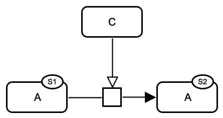

		</td>
		<td style="width:130px; text-align:center;">
			
		</td>
	</tr>
	<tr style="font-size:90%">
		<td style="width:300px; text-align:center;">
			<a href="../images/specification/i-sti-i/pd.sbgn">SBGN-ML</a>&ensp;
			<a href="http://web.newteditor.org/?URL=http://188.166.159.222/specification/i-sti-i/pd.sbgn" target="_blank">Newt</a>
		</td>
		<td style="width:130px; text-align:center;">
			<a href="../images/specification/i-sti-i/af.sbgn">SBGN-ML</a>&ensp;
			<a href="http://web.newteditor.org/?URL=http://188.166.159.222/specification/i-sti-i/af.sbgn" target="_blank">Newt</a>
		</td>
	</tr>
</table> 

	

	

   <h3>2. i-cat-i</h3>

<table class="rules-table">
	<tr>
		<td style="width:300px; text-align:center;">
			
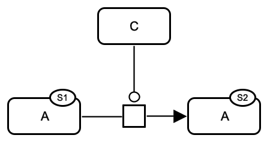

		</td>
		<td style="width:130px; text-align:center;">
			
		</td>
	</tr>
        <tr style="font-size:90%">
		<td style="width:300px; text-align:center;">
			<a href="../images/specification/i-cat-i/pd.sbgn">SBGN-ML</a>&ensp;
			<a href="http://web.newteditor.org/?URL=http://sbgnbricks.github.io/images/specification/i-cat-i/pd.sbgn" target="_blank">Newt</a>
		</td>
		<td style="width:130px; text-align:center;">
			<a href="../images/specification/i-cat-i/af.sbgn">SBGN-ML</a>&ensp;
			<a href="http://web.newteditor.org/?URL=http://sbgnbricks.github.io/images/specification/i-cat-i/af.sbgn" target="_blank">Newt</a>
		</td>
        </tr>
</table> 

	

	

   <h3>3. i-nsti-i</h3>

<table class="rules-table">
	<tr style="font-size:90%">
		<td style="width:300px; text-align:center;">
			

		</td>
		<td style="width:130px; text-align:center;">
			
		</td>
	</tr>
	<tr style="font-size:90%">
		<td style="width:300px; text-align:center;">
			<a href="../images/specification/i-nsti-i/pd.sbgn">SBGN-ML</a>&ensp;
			<a href="http://web.newteditor.org/?URL=http://sbgnbricks.github.io/images/specification/i-nsti-i/pd.sbgn" target="_blank">Newt</a>
		</td>
		<td style="width:130px; text-align:center;">
			<a href="../images/specification/i-nsti-i/af.sbgn">SBGN-ML</a>&ensp;
			<a href="http://web.newteditor.org/?URL=http://sbgnbricks.github.io/images/specification/i-nsti-i/af.sbgn" target="_blank">Newt</a>
		</td>
	</tr>
</table> 

	

	

   <h3>4. i-mod-i</h3>

<table class="rules-table">
	<tr style="font-size:90%">
		<td style="width:300px; text-align:center;">
			
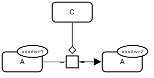

		</td>
		<td style="width:130px; text-align:center;">
			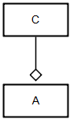
		</td>
	</tr>
	<tr style="font-size:90%">
		<td style="width:300px; text-align:center;">
			<a href="../images/specification/i-mod-i/pd.sbgn">SBGN-ML</a>&ensp;
			<a href="http://web.newteditor.org/?URL=http://sbgnbricks.github.io/images/specification/i-mod-i/pd.sbgn" target="_blank">Newt</a>
		</td>
		<td style="width:130px; text-align:center;">
			<a href="../images/specification/i-mod-i/af.sbgn">SBGN-ML</a>&ensp;
			<a href="http://web.newteditor.org/?URL=http://sbgnbricks.github.io/images/specification/i-mod-i/af.sbgn" target="_blank">Newt</a>
		</td>
	</tr>
</table> 
	

	

   <h3>5. i-inh-i</h3>

<table class="rules-table">
	<tr style="font-size:90%">
		<td style="width:300px; text-align:center;">
			

		</td>
		<td style="width:130px; text-align:center;">
			
		</td>
	</tr>
	<tr style="font-size:90%">
		<td style="width:300px; text-align:center;">
			<a href="../images/specification/i-inh-i/pd.sbgn">SBGN-ML</a>&ensp;
			<a href="http://web.newteditor.org/?URL=http://sbgnbricks.github.io/images/specification/i-inh-i/pd.sbgn" target="_blank">Newt</a>
		</td>
		<td style="width:130px; text-align:center;">
			<a href="../images/specification/i-inh-i/af.sbgn">SBGN-ML</a>&ensp;
			<a href="http://web.newteditor.org/?URL=http://sbgnbricks.github.io/images/specification/i-inh-i/af.sbgn" target="_blank">Newt</a>
		</td>
	</tr>
</table> 
	

	

   <h3>6. i-sti-a</h3>

<table class="rules-table">
	<tr style="font-size:90%">
		<td style="width:300px; text-align:center;">
			
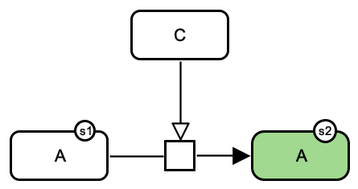

		</td>
		<td style="width:130px; text-align:center;">
			
		</td>
	</tr>
	<tr style="font-size:90%">
		<td style="width:300px; text-align:center;">
			<a href="../images/specification/i-sti-a/pd.sbgn">SBGN-ML</a>&ensp;
			<a href="http://web.newteditor.org/?URL=http://sbgnbricks.github.io/images/specification/i-sti-a/pd.sbgn" target="_blank">Newt</a>
		</td>
		<td style="width:130px; text-align:center;">
			<a href="../images/specification/i-sti-a/af.sbgn">SBGN-ML</a>&ensp;
			<a href="http://web.newteditor.org/?URL=http://sbgnbricks.github.io/images/specification/i-sti-a/af.sbgn" target="_blank">Newt</a>
		</td>
	</tr>
</table> 
	

	

   <h3>7. i-cat-a</h3>

<table class="rules-table">
	<tr style="font-size:90%">
		<td style="width:300px; text-align:center;">
			
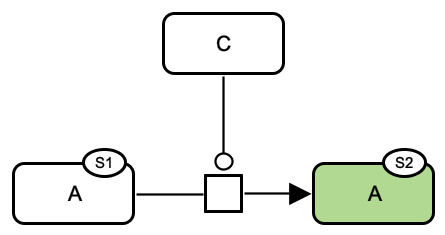

		</td>
		<td style="width:130px; text-align:center;">
			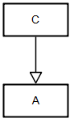
		</td>
	</tr>
	<tr style="font-size:90%">
		<td style="width:300px; text-align:center;">
			<a href="../images/specification/i-cat-a/pd.sbgn">SBGN-ML</a>&ensp;
			<a href="http://web.newteditor.org/?URL=http://sbgnbricks.github.io/images/specification/i-cat-a/pd.sbgn" target="_blank">Newt</a>
		</td>
		<td style="width:130px; text-align:center;">
			<a href="../images/specification/i-cat-a/af.sbgn">SBGN-ML</a>&ensp;
			<a href="http://web.newteditor.org/?URL=http://sbgnbricks.github.io/images/specification/i-cat-a/af.sbgn" target="_blank">Newt</a>
		</td>
	</tr>
</table> 

	

	

   <h3>8. i-nsti-a</h3>

<table class="rules-table">
	<tr style="font-size:90%">
		<td style="width:300px; text-align:center;">
			

		</td>
		<td style="width:130px; text-align:center;">
			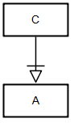
		</td>
	</tr>
	<tr style="font-size:90%">
		<td style="width:300px; text-align:center;">
			<a href="../images/specification/i-nsti-a/pd.sbgn">SBGN-ML</a>&ensp;
			<a href="http://web.newteditor.org/?URL=http://sbgnbricks.github.io/images/specification/i-nsti-a/pd.sbgn" target="_blank">Newt</a>
		</td>
		<td style="width:130px; text-align:center;">
			<a href="../images/specification/i-nsti-a/af.sbgn">SBGN-ML</a>&ensp;
			<a href="http://web.newteditor.org/?URL=http://sbgnbricks.github.io/images/specification/i-nsti-a/af.sbgn" target="_blank">Newt</a>
		</td>
	</tr>
</table> 

	

	

   <h3>9. i-mod-a</h3>

<table class="rules-table">
	<tr style="font-size:90%">
		<td style="width:300px; text-align:center;">
			
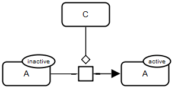

		</td>
		<td style="width:130px; text-align:center;">
			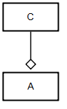
		</td>
	</tr>
	<tr style="font-size:90%">
		<td style="width:300px; text-align:center;">
			<a href="../images/specification/i-mod-a/pd.sbgn">SBGN-ML</a>&ensp;
			<a href="http://web.newteditor.org/?URL=http://sbgnbricks.github.io/images/specification/i-mod-a/pd.sbgn" target="_blank">Newt</a>
		</td>
		<td style="width:130px; text-align:center;">
			<a href="../images/specification/i-mod-a/af.sbgn">SBGN-ML</a>&ensp;
			<a href="http://web.newteditor.org/?URL=http://sbgnbricks.github.io/images/specification/i-mod-a/af.sbgn" target="_blank">Newt</a>
		</td>
	</tr>
</table> 

	

	

   <h3>10. i-inh-a</h3>

<table class="rules-table">
	<tr style="font-size:90%">
		<td style="width:300px; text-align:center;">
			

		</td>
		<td style="width:130px; text-align:center;">
			
		</td>
	</tr>
	<tr style="font-size:90%">
		<td style="width:300px; text-align:center;">
			<a href="../images/specification/i-inh-a/pd.sbgn">SBGN-ML</a>&ensp;
			<a href="http://web.newteditor.org/?URL=http://sbgnbricks.github.io/images/specification/i-inh-a/pd.sbgn" target="_blank">Newt</a>
		</td>
		<td style="width:130px; text-align:center;">
			<a href="../images/specification/i-inh-a/af.sbgn">SBGN-ML</a>&ensp;
			<a href="http://web.newteditor.org/?URL=http://sbgnbricks.github.io/images/specification/i-inh-a/af.sbgn" target="_blank">Newt</a>
		</td>
	</tr>
</table> 

	

	

   <h3>11. a-sti-i</h3>

<table class="rules-table">
	<tr style="font-size:90%">
		<td style="width:300px; text-align:center;">
			
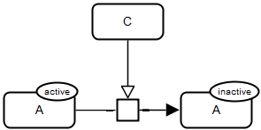

		</td>
		<td style="width:130px; text-align:center;">
			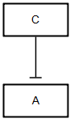
		</td>
	</tr>
	<tr style="font-size:90%">
		<td style="width:300px; text-align:center;">
			<a href="../images/specification/a-sti-i/pd.sbgn">SBGN-ML</a>&ensp;
			<a href="http://web.newteditor.org/?URL=http://sbgnbricks.github.io/images/specification/a-sti-i/pd.sbgn" target="_blank">Newt</a>
		</td>
		<td style="width:130px; text-align:center;">
			<a href="../images/specification/a-sti-i/af.sbgn">SBGN-ML</a>&ensp;
			<a href="http://web.newteditor.org/?URL=http://sbgnbricks.github.io/images/specification/a-sti-i/af.sbgn" target="_blank">Newt</a>
		</td>
	</tr>
</table> 
	

	

   <h3>12. a-cat-i</h3>

<table class="rules-table">
	<tr style="font-size:90%">
		<td style="width:300px; text-align:center;">
			
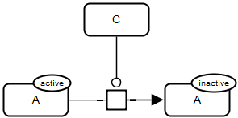

		</td>
		<td style="width:130px; text-align:center;">
			
		</td>
	</tr>
	<tr style="font-size:90%">
		<td style="width:300px; text-align:center;">
			<a href="../images/specification/a-cat-i/pd.sbgn">SBGN-ML</a>&ensp;
			<a href="http://web.newteditor.org/?URL=http://sbgnbricks.github.io/images/specification/a-cat-i/pd.sbgn" target="_blank">Newt</a>
		</td>
		<td style="width:130px; text-align:center;">
			<a href="../images/specification/a-cat-i/af.sbgn">SBGN-ML</a>&ensp;
			<a href="http://web.newteditor.org/?URL=http://sbgnbricks.github.io/images/specification/a-cat-i/af.sbgn" target="_blank">Newt</a>
		</td>
	</tr>
</table> 

	

	

   <h3>13. a-nsti-i</h3>

<table class="rules-table">
	<tr style="font-size:90%">
		<td style="width:300px; text-align:center;">
			

		</td>
		<td style="width:130px; text-align:center;">
			
		</td>
	</tr>
	<tr style="font-size:90%">
		<td style="width:300px; text-align:center;">
			<a href="../images/specification/a-nsti-i/pd.sbgn">SBGN-ML</a>&ensp;
			<a href="http://web.newteditor.org/?URL=http://sbgnbricks.github.io/images/specification/a-nsti-i/pd.sbgn" target="_blank">Newt</a>
		</td>
		<td style="width:130px; text-align:center;">
			<a href="../images/specification/a-nsti-i/af.sbgn">SBGN-ML</a>&ensp;
			<a href="http://web.newteditor.org/?URL=http://sbgnbricks.github.io/images/specification/a-nsti-i/af.sbgn" target="_blank">Newt</a>
		</td>
	</tr>
</table> 

	

	

   <h3>14. a-mod-i</h3>

<table class="rules-table">
	<tr style="font-size:90%">
		<td style="width:300px; text-align:center;">
			
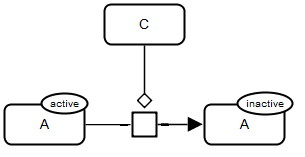

		</td>
		<td style="width:130px; text-align:center;">
			
		</td>
	</tr>
	<tr style="font-size:90%">
		<td style="width:300px; text-align:center;">
			<a href="../images/specification/a-mod-i/pd.sbgn">SBGN-ML</a>&ensp;
			<a href="http://web.newteditor.org/?URL=http://sbgnbricks.github.io/images/specification/a-mod-i/pd.sbgn" target="_blank">Newt</a>
		</td>
		<td style="width:130px; text-align:center;">
			<a href="../images/specification/a-mod-i/af.sbgn">SBGN-ML</a>&ensp;
			<a href="http://web.newteditor.org/?URL=http://sbgnbricks.github.io/images/specification/a-mod-i/af.sbgn" target="_blank">Newt</a>
		</td>
	</tr>
</table> 

	

	

   <h3>15. a-inh-i</h3>

<table class="rules-table">
	<tr style="font-size:90%">
		<td style="width:300px; text-align:center;">
			

		</td>
		<td style="width:130px; text-align:center;">
			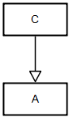
		</td>
	</tr>
	<tr style="font-size:90%">
		<td style="width:300px; text-align:center;">
			<a href="../images/specification/a-inh-i/pd.sbgn">SBGN-ML</a>&ensp;
			<a href="http://web.newteditor.org/?URL=http://sbgnbricks.github.io/images/specification/a-inh-i/pd.sbgn" target="_blank">Newt</a>
		</td>
		<td style="width:130px; text-align:center;">
			<a href="../images/specification/a-inh-i/af.sbgn">SBGN-ML</a>&ensp;
			<a href="http://web.newteditor.org/?URL=http://sbgnbricks.github.io/images/specification/a-inh-i/af.sbgn" target="_blank">Newt</a>
		</td>
	</tr>
</table> 

	

	

   <h3>16. a-sti-a</h3>

<table class="rules-table">
	<tr style="font-size:90%">
		<td style="width:300px; text-align:center;">
			
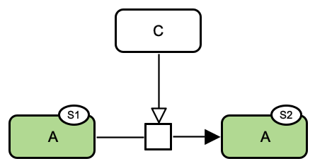

		</td>
		<td style="width:300px; text-align:center;">
			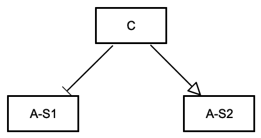
		</td>
	</tr>
	<tr style="font-size:90%">
		<td style="width:300px; text-align:center;">
			<a href="../images/specification/a-sti-a/pd.sbgn">SBGN-ML</a>&ensp;
			<a href="http://web.newteditor.org/?URL=http://sbgnbricks.github.io/images/specification/a-sti-a/pd.sbgn" target="_blank">Newt</a>
		</td>
		<td style="width:300px; text-align:center;">
			<a href="../images/specification/a-sti-a/af.sbgn">SBGN-ML</a>&ensp;
			<a href="http://web.newteditor.org/?URL=http://sbgnbricks.github.io/images/specification/a-sti-a/af.sbgn" target="_blank">Newt</a>
		</td>
	</tr>
</table> 
	

	

   <h3>17. a-cat-a</h3>

<table class="rules-table">
	<tr style="font-size:90%">
		<td style="width:300px; text-align:center;">
			
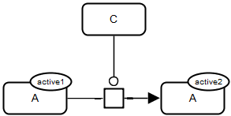

		</td>
		<td style="width:300px; text-align:center;">
			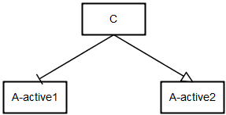
		</td>
	</tr>
	<tr style="font-size:90%">
		<td style="width:300px; text-align:center;">
			<a href="../images/specification/a-cat-a/pd.sbgn">SBGN-ML</a>&ensp;
			<a href="http://web.newteditor.org/?URL=http://sbgnbricks.github.io/images/specification/a-cat-a/pd.sbgn" target="_blank">Newt</a>
		</td>
		<td style="width:300px; text-align:center;">
			<a href="../images/specification/a-cat-a/af.sbgn">SBGN-ML</a>&ensp;
			<a href="http://web.newteditor.org/?URL=http://sbgnbricks.github.io/images/specification/a-cat-a/af.sbgn" target="_blank">Newt</a>
		</td>
	</tr>
</table> 

	

	

   <h3>18. a-nsti-a</h3>

<table class="rules-table">
	<tr style="font-size:90%">
		<td style="width:300px; text-align:center;">
			
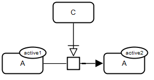

		</td>
		<td style="width:300px; text-align:center;">
			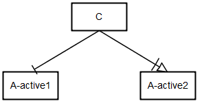
		</td>
	</tr>
	<tr style="font-size:90%">
		<td style="width:300px; text-align:center;">
			<a href="../images/specification/a-nsti-a/pd.sbgn">SBGN-ML</a>&ensp;
			<a href="http://web.newteditor.org/?URL=http://sbgnbricks.github.io/images/specification/a-nsti-a/pd.sbgn" target="_blank">Newt</a>
		</td>
		<td style="width:300px; text-align:center;">
			<a href="../images/specification/a-nsti-a/af.sbgn">SBGN-ML</a>&ensp;
			<a href="http://web.newteditor.org/?URL=http://sbgnbricks.github.io/images/specification/a-nsti-a/af.sbgn" target="_blank">Newt</a>
		</td>
	</tr>
</table> 

	

	

   <h3>19. a-mod-a</h3>

<table class="rules-table">
	<tr style="font-size:90%">
		<td style="width:300px; text-align:center;">
			
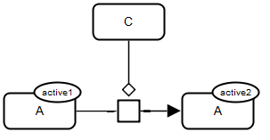

		</td>
		<td style="width:300px; text-align:center;">
			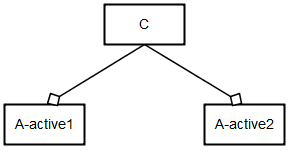
		</td>
	</tr>
	<tr style="font-size:90%">
		<td style="width:300px; text-align:center;">
			<a href="../images/specification/a-mod-a/pd.sbgn">SBGN-ML</a>&ensp;
			<a href="http://web.newteditor.org/?URL=http://sbgnbricks.github.io/images/specification/a-mod-a/pd.sbgn" target="_blank">Newt</a>
		</td>
	<td style="width:300px; text-align:center;">
			<a href="../images/specification/a-mod-a/af.sbgn">SBGN-ML</a>&ensp;
			<a href="http://web.newteditor.org/?URL=http://sbgnbricks.github.io/images/specification/a-mod-a/af.sbgn" target="_blank">Newt</a>
		</td>
	</tr>
</table> 

	

	

   <h3>20. a-inh-a</h3>

<table class="rules-table">
	<tr style="font-size:90%">
		<td style="width:300px; text-align:center;">
			
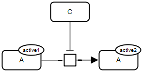

		</td>
		<td style="width:300px; text-align:center;">
			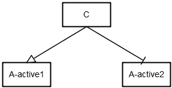
		</td>
	</tr>
	<tr style="font-size:90%">
		<td style="width:300px; text-align:center;">
			<a href="../images/specification/a-inh-a/pd.sbgn">SBGN-ML</a>&ensp;
			<a href="http://web.newteditor.org/?URL=http://sbgnbricks.github.io/images/specification/a-inh-a/pd.sbgn" target="_blank">Newt</a>
		</td>
		<td style="width:300px; text-align:center;">
			<a href="../images/specification/a-inh-a/af.sbgn">SBGN-ML</a>&ensp;
			<a href="http://web.newteditor.org/?URL=http://sbgnbricks.github.io/images/specification/a-inh-a/af.sbgn" target="_blank">Newt</a>
		</td>
	</tr>
</table>

	

   

  </body>
