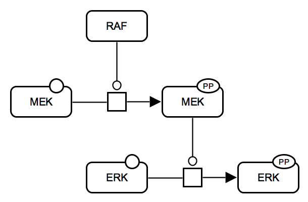
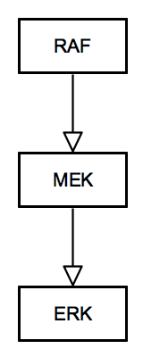
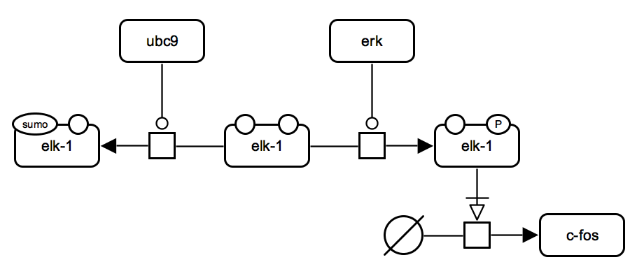
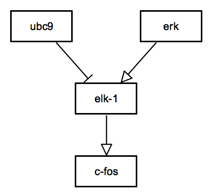
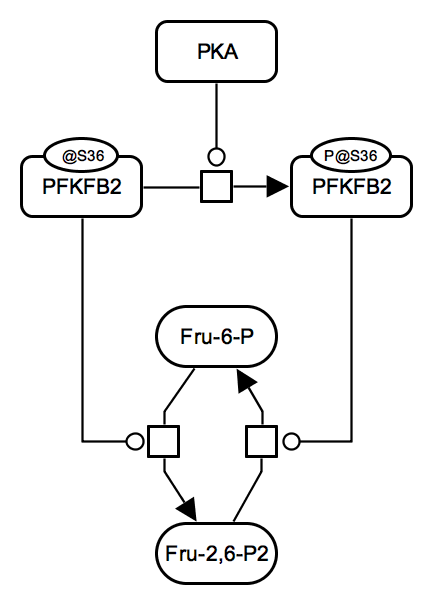
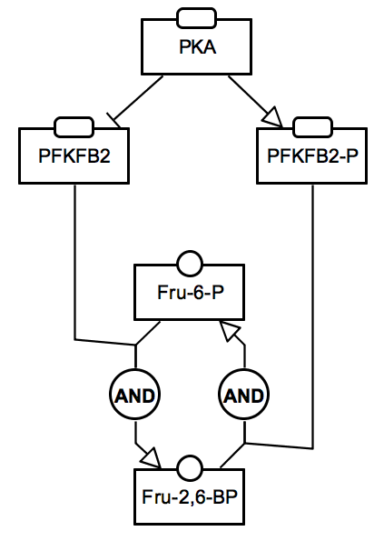

# Examples

### ERK signalling

<table>
    <tr style="font-size:90%;">
    <td style="width:500px; text-align:center; font-size:90%;"> <a href="../images/examples/E001.pd.sbgn">SBGN-ML</a> &ensp; <a href="http://web.newteditor.org/?URL=http://pd2af.github.io/images/examples/E001.pd.sbgn" target="_blank">Newt</a></td>
    <td style="width:300px; text-align:center; font-size:90%;"> <a href="../images/examples/E001.af.sbgn">SBGN-ML</a> &ensp; <a href="http://web.newteditor.org/?URL=http://pd2af.github.io/images/examples/E001.af.sbgn" target="_blank">Newt</a></td>
    </tr>
</table>

A comparatively simple case: only one activity corresponds to each protein. The incoming default state is "ignored" and is not reflected in the Activity Flow view (on the right).

### ELK1 signalling

<table>
    <tr style="font-size:90%;">
    <td style="width:500px; text-align:center; font-size:90%;"> <a href="../images/examples/E002.pd.sbgn">SBGN-ML</a> &ensp; <a href="http://web.newteditor.org/?URL=http://pd2af.github.io/images/examples/E002.pd.sbgn" target="_blank">Newt</a></td>
    <td style="width:300px; text-align:center; font-size:90%;"> <a href="../images/examples/E002.af.sbgn">SBGN-ML</a> &ensp; <a href="http://web.newteditor.org/?URL=http://pd2af.github.io/images/examples/E002.af.sbgn" target="_blank">Newt</a></td>
    </tr>
</table>

Please note how the relationships between UBC9 and ELK1 are shown in Process Description (on the left) and Activity Flow (on the right). This conversion rule corresponds to the enhanced pattern-recognition funtionality of the PD2AF converter.

### Regulation of glycolysis

<table>
    <tr style="font-size:90%;">
    <td style="width:500px; text-align:center; font-size:90%;"> <a href="../images/examples/E003.pfkfb2.pd.sbgn">SBGN-ML</a> &ensp; <a href="http://web.newteditor.org/?URL=http://pd2af.github.io/images/examples/E003.pfkfb2.pd.sbgn" target="_blank">Newt</a></td>
    <td style="width:300px; text-align:center; font-size:90%;"> <a href="../images/examples/E003.pfkfb2.af.sbgn">SBGN-ML</a> &ensp; <a href="http://web.newteditor.org/?URL=http://pd2af.github.io/images/examples/E003.pfkfb2.af.sbgn" target="_blank">Newt</a></td>
    </tr>
</table>

Both unphosphorylated and phosphorylated states of PFKFB2 are active and both need to be kept in the Activity Flow representation.
