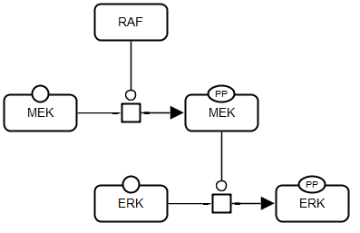

# Examples

<h3>Raf-Mek-Erk</h3>
<table>
	<tr style="font-size:90%;">
		<td style="text-align:center; font-size:90%;">
			
			 
			<a href="../examples/raf-mek-erk/pd.sbgn">SBGN-ML</a>&ensp;			<a href="http://web.newteditor.org/?URL=https://pd2af.github.io/examples/raf-mek-erk/pd.sbgn" target="_blank">Newt</a>
		</td>
		<td style="text-align:center; font-size:90%;">
			
			 
			<a href="../examples/raf-mek-erk/af.sbgn">SBGN-ML</a>&ensp;			<a href="http://web.newteditor.org/?URL=https://pd2af.github.io/examples/raf-mek-erk/af.sbgn" target="_blank">Newt</a>
		</td>
	</tr>
	<tr style="line-height: 3em">
		<td colspan="2" style="text-align:left; font-size:90%;">RAF-MEK-ERK</td>
	</tr>
	<tr style="line-height: 3em">
		<td colspan="2" style="text-align:left; font-size:90%;"></td>
	</tr>
</table>
