# Translation rules

Translation rules take into account not only a partial SBGN brick but also the surrounding connected bricks - contextual network information. By **active entity** we mean an entity that participate in following steps of the pathway/network. It is a glyph that has outgoing regulatory arcs (catalysis, stimulation, inhibition) or connected to other processes via a consumption arc.  

For each pair of diagrams, the Process Description view is shown on the left side and the Activity Flow view is shown on the right side.

### Catalysis of irreversible metabolic reaction

Associated GO term: [GO:0009893 positive regulation of metabolic process](http://amigo.geneontology.org/amigo/term/GO:0009893)

<table>
    <tr style="font-size:90%;">
    <td style="width:280px; text-align:center; font-size:90%;">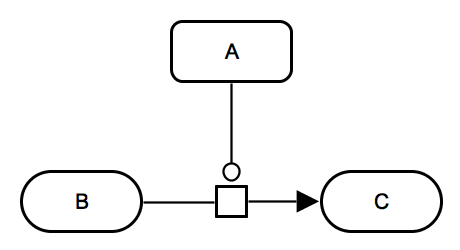 <a href="../images/rules/R002.cat.sbgn">SBGN-ML</a> &ensp; <a href="http://web.newteditor.org/?URL=http://pd2af.github.io/images/rules/R002.cat.pd.sbgn" target="_blank">Newt</a></td>
    <td style="width:280px; text-align:center; font-size:90%;">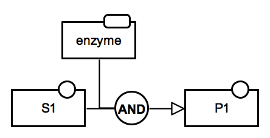 <a href="../images/rules/R001.cat.af.sbgn">SBGN-ML</a> &ensp; <a href="http://web.newteditor.org/?URL=http://pd2af.github.io/images/rules/R001.cat.af.sbgn" target="_blank">Newt</a></td>
    </tr>
</table>

A convertion of a reaction with one substrate and one product. In contrast to macromolecule state transition representation, all metabolites are kept in the Activity Flow veiw.

<table>
    <tr style="font-size:90%;">
    <td style="width:280px; text-align:center; font-size:90%;">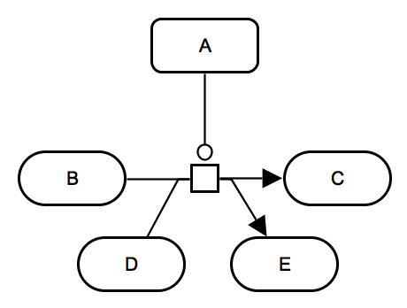 <a href="../images/rules/R002.catpd.sbgn">SBGN-ML</a> &ensp; <a href="http://web.newteditor.org/?URL=http://pd2af.github.io/images/rules/R002.cat.pd.sbgn" target="_blank">Newt</a></td>
    <td style="width:280px; text-align:center; font-size:90%;">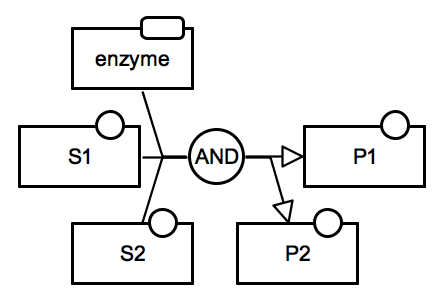 <a href="../images/rules/R002.cat.af.sbgn">SBGN-ML</a> &ensp; <a href="http://web.newteditor.org/?URL=http://pd2af.github.io/images/rules/R002.cat.af.sbgn" target="_blank">Newt</a></td>
    </tr>
</table>

A convertion of a reaction with multiple substrates and products. There might be an option (curently not available yet) in which "currency" metabolites such as ATP, ADP, NADPH, NADP+, H2O etc. are ommited in the Activity Flow view.

IMPORTNAT: Demerging outgoing arcs are not allowed according the current version of SBGN Process Description specification. The demerging arcs are proposed, and there is the corresponding discussion within the SBGN community.

### Inhibition of irreversible metabolic reaction

Associated GO term: [GO:0009892 negative regulation of metabolic process](http://amigo.geneontology.org/amigo/term/GO:0009892)

<table>
    <tr style="font-size:90%;">
    <td style="width:280px; text-align:center; font-size:90%;"> <a href="../images/rules/R003.Inh.pd.sbgn">SBGN-ML</a> &ensp; <a href="http://web.newteditor.org/?URL=http://sbgnbricks.github.io/images/rules/R003.Inh.pd.sbgn" target="_blank">Newt</a></td>
    <td style="width:280px; text-align:center; font-size:90%;">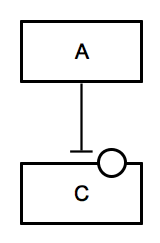 <a href="../images/rules/R003.Inh.af.sbgn">SBGN-ML</a> &ensp; <a href="http://web.newteditor.org/?URL=http://sbgnbricks.github.io/images/rules/R003.Inh.af.sbgn" target="_blank">Newt</a></td>
    </tr>
</table>

The assumption is that simple chemical C is the important "active" molecule and not simple chemical B. In case simple chemical B is the main entity (participates in other reactions or is an active signalling molecule), then in AF the <i>negative influence</i> arc would be replaced by <i>positive influence</i> arc leading to B, and the activity of C could be ignored.

### Activation of protein phosphorylation: active phosphorylated state

Associated GO term: [GO:0001934 positive regulation of protein phosphorylation](http://amigo.geneontology.org/amigo/term/GO:0001934)

<table>
    <tr style="font-size:90%;">
    <td style="width:280px; text-align:center; font-size:90%;">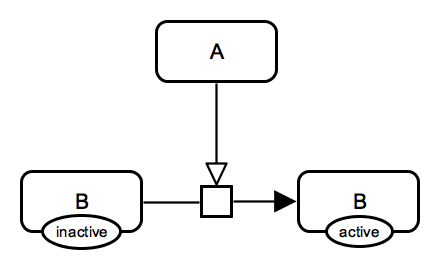 <a href="../images/rules/R005.Ph.pd.sbgn">SBGN-ML</a> &ensp; <a href="http://web.newteditor.org/?URL=http://pd2af.github.io/images/rules/R005.Ph.pd.sbgn" target="_blank">Newt</a></td>
    <td style="width:280px; text-align:center; font-size:90%;">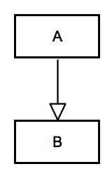 <a href="../images/rules/R005.Ph.af.sbgn">SBGN-ML</a> &ensp; <a href="http://web.newteditor.org/?URL=http://pd2af.github.io/images/rules/R005.Ph.af.sbgn" target="_blank">Newt</a></td>
    </tr>
</table>

This translation is conditional. It assumes that 1) the unphosphorylated state is not active, i.e. there are no outgoing regulatory arcs, 2) the resulting state is active towards another process, i.e. there are outgoing regulatory arcs or there could be (might not be shown on the diagram).

### Activation of protein phosphorylation: active unphosphorylated state

Associated GO term: [GO:0001934 positive regulation of protein phosphorylation](http://amigo.geneontology.org/amigo/term/GO:0001934)

<table>
    <tr style="font-size:90%;">
    <td style="width:280px; text-align:center; font-size:90%;">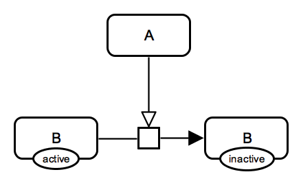 <a href="../images/rules/R006.Inh.pd.sbgn">SBGN-ML</a> &ensp; <a href="http://web.newteditor.org/?URL=http://pd2af.github.io/images/rules/R006.Inh.pd.sbgn" target="_blank">Newt</a></td>
    <td style="width:280px; text-align:center; font-size:90%;">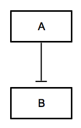 <a href="../images/rules/R006.Inh.af.sbgn">SBGN-ML</a> &ensp; <a href="http://web.newteditor.org/?URL=http://pd2af.github.io/images/rules/R006.Inh.af.sbgn" target="_blank">Newt</a></td>
    </tr>
</table>

This is a case of a "hidden" inhibition: from the Process Description version it is not obvious that this is an inhibition because the mechanism is shown in details and the inhibition arc is not used. Protein A stimulates a process of protein B deactivation (the state of the left is shown as active), and therefore in Activity Flow it is represented by the protein A activity inhibiting the protein B activity.  

### Activation of protein phosphorylation: both states are active

Associated GO term: [GO:0001934 positive regulation of protein phosphorylation](http://amigo.geneontology.org/amigo/term/GO:0001934)

<table>
    <tr style="font-size:90%;">
    <td style="width:280px; text-align:center; font-size:90%;"> <a href="../images/rules/R008.Ph.pd.sbgn">SBGN-ML</a> &ensp; <a href="http://web.newteditor.org/?URL=http://pd2af.github.io/images/rules/R008.Ph.pd.sbgn" target="_blank">Newt</a></td>
    <td style="width:280px; text-align:center; font-size:90%;">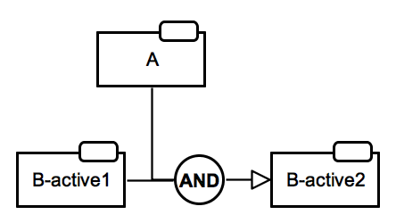 <a href="../images/rules/R008.Ph.af.sbgn">SBGN-ML</a> &ensp; <a href="http://web.newteditor.org/?URL=http://pd2af.github.io/images/rules/R008.Ph.af.sbgn" target="_blank">Newt</a></td>
    </tr>
</table>

In case when both states are active (connected to other processes via regulatory arcs), it is important to show two activities of the same protein, otherwise the translation will introduce wrong statements. This version of conversion is done via the use of the _AND operator_.

<table>
    <tr style="font-size:90%;">
    <td style="width:280px; text-align:center; font-size:90%;"> <a href="../images/rules/R009.Ph.pd.sbgn">SBGN-ML</a> &ensp; <a href="http://web.newteditor.org/?URL=http://pd2af.github.io/images/rules/R009.Ph.pd.sbgn" target="_blank">Newt</a></td>
    <td style="width:280px; text-align:center; font-size:90%;">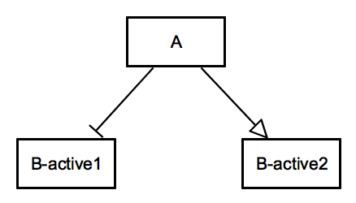 <a href="../images/rules/R009.Ph.af.sbgn">SBGN-ML</a> &ensp; <a href="http://web.newteditor.org/?URL=http://pd2af.github.io/images/rules/R009.Ph.af.sbgn" target="_blank">Newt</a></td>
    </tr>
</table>

An alternative translation that shows the inhibition of the ingoing state of the protein using the _inhibition arc_.  

An example case is the [phosphorylation of bifuntional enzyme PFKFB2 by PKA](http://metabolismregulation.org/glycolysis/).

### Activation of protein phosphorylation: both states are inactive (dead end) - assumed active phosphorylated state

Associated GO term: [GO:0001934 positive regulation of protein phosphorylation](http://amigo.geneontology.org/amigo/term/GO:0001934)

<table>
    <tr style="font-size:90%;">
    <td style="width:280px; text-align:center; font-size:90%;">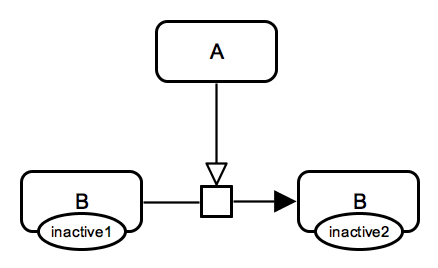 <a href="../images/rules/R007.Ph.pd.sbgn">SBGN-ML</a> &ensp; <a href="http://web.newteditor.org/?URL=http://pd2af.github.io/images/rules/R007.Ph.pd.sbgn" target="_blank">Newt</a></td>
    <td style="width:280px; text-align:center; font-size:90%;"> <a href="../images/rules/R007.Ph.af.sbgn">SBGN-ML</a> &ensp; <a href="http://web.newteditor.org/?URL=http://pd2af.github.io/images/rules/R007.Ph.af.sbgn" target="_blank">Newt</a></td>
    </tr>
</table>

IMPORTANT: This rules assumes that the resulting state is the active one. It is not a strict rule and potentially can cause wrong translation.

### Oligomerisation

Associated GO term: [GO:0051259 protein complex oligomerization](http://amigo.geneontology.org/amigo/term/GO:0051259)

<table>
    <tr style="font-size:90%;">
    <td style="width:280px; text-align:center; font-size:90%;">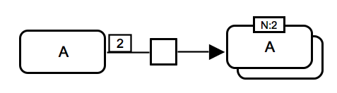 <a href="../images/rules/R011.Olig.pd.sbgn">SBGN-ML</a> &ensp; <a href="http://web.newteditor.org/?URL=http://pd2af.github.io/images/rules/R011.Olig.pd.sbgn" target="_blank">Newt</a></td>
    <td style="width:280px; text-align:center; font-size:90%;">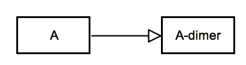 <a href="../images/rules/R011.Olig.af.sbgn">SBGN-ML</a> &ensp; <a href="http://web.newteditor.org/?URL=http://pd2af.github.io/images/rules/R011.Olig.af.sbgn" target="_blank">Newt</a></td>
    </tr>
</table>

Both monomer and the corresponding oligomer (for example, homodimer) are kept in the conversion.

### Translocation

Associated GO terms: [GO:0006810 transport](http://amigo.geneontology.org/amigo/term/GO:0006810); [GO:0051050 positive regulation of transport](http://amigo.geneontology.org/amigo/term/GO:0051050)

<table>
    <tr style="font-size:90%;">
    <td style="width:280px; text-align:center; font-size:90%;"> <a href="../images/rules/R010.Trans.pd.sbgn">SBGN-ML</a> &ensp; <a href="http://web.newteditor.org/?URL=http://pd2af.github.io/images/rules/R010.Trans.pd.sbgn" target="_blank">Newt</a></td>
    <td style="width:280px; text-align:center; font-size:90%;">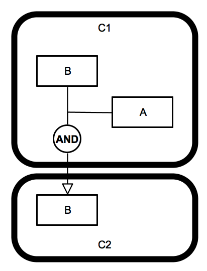 <a href="../images/rules/R010.Trans.af.sbgn">SBGN-ML</a> &ensp; <a href="http://web.newteditor.org/?URL=http://pd2af.github.io/images/rules/R010.Trans.af.sbgn" target="_blank">Newt</a></td>
    </tr>
</table>

Protein A stimulates the translocation of protein B from compartment C1 to compartment C2.
