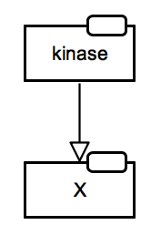

# Translation rules

Translation rules take into account not only a partical SBGN brick but also the surrounding connected bricks - contextual network iformation. By _active entity_ we mean an entity that participate in following steps of the pathway/network. It is a glyph that has outgoing regulatory arcs (catalysis, stimulation, inhibition) or connected to other processes via a consumption arc.  

### Catalysis

Associated GO term: [GO:0009893 positive regulation of metabolic process](http://amigo.geneontology.org/amigo/term/GO:0009893)

<table>
    <tr style="font-size:90%;">
    <td style="width:220px; text-align:center; font-size:90%;"> <a href="../rules/met-sti/pd.sbgn">SBGN-ML</a> &ensp; <a href="http://web.newteditor.org/?URL=http://sbgnbricks.github.io/rules/met-sti/pd.sbgn" target="_blank">Newt</a></td>
    <td style="width:220px; text-align:center; font-size:90%;"> <a href="../rules/met-sti/af.sbgn">SBGN-ML</a> &ensp; <a href="http://web.newteditor.org/?URL=http://sbgnbricks.github.io/rules/met-sti/af.sbgn" target="_blank">Newt</a></td>
    <td style="vertical-align: middle; padding-left: 1em;"> </td>
    </tr>
</table>

<table>
    <tr style="font-size:90%;">
    <td style="width:220px; text-align:center; font-size:90%;"> <a href="../rules/met-sti/pd.sbgn">SBGN-ML</a> &ensp; <a href="http://web.newteditor.org/?URL=http://sbgnbricks.github.io/rules/met-sti/pd.sbgn" target="_blank">Newt</a></td>
    <td style="width:220px; text-align:center; font-size:90%;"> <a href="../rules/met-sti/af.sbgn">SBGN-ML</a> &ensp; <a href="http://web.newteditor.org/?URL=http://sbgnbricks.github.io/images/rules/catalysis.2x2.af.sbgn" target="_blank">Newt</a></td>
    <td style="vertical-align: middle; padding-left: 1em;"> </td>
    </tr>
</table>

### Inhibition of irreversible metabolic reaction

Associated GO term: [GO:0009892 negative regulation of metabolic process](http://amigo.geneontology.org/amigo/term/GO:0009892)

<table>
    <tr style="font-size:90%;">
    <td style="width:220px; text-align:center; font-size:90%;"> <a href="../rules/met-inh/pd.sbgn">SBGN-ML</a> &ensp; <a href="http://web.newteditor.org/?URL=http://sbgnbricks.github.io/rules/met-inh/pd.sbgn" target="_blank">Newt</a></td>
    <td style="width:220px; text-align:center; font-size:90%;"> <a href="../rules/met-inh/af.sbgn">SBGN-ML</a> &ensp; <a href="http://web.newteditor.org/?URL=http://sbgnbricks.github.io/rules/met-inh/af.sbgn" target="_blank">Newt</a></td>
    <td style="vertical-align: middle; padding-left: 1em;">The assumption is that simple chemical C is the important "active" molecule and not simple chemical B. In case simple chemical B is the main entity (participates in other reactions or is an active signalling molecule), then in AF the <i>negative influence</i> arc would be replaced by <i>positive influence</i> arc leading to B, and the activity of C could be ignored.</td>
    </tr>
</table>

### Activation of protein phosphorylation: active phosphorylated state

Associated GO term: [GO:0001934 positive regulation of protein phosphorylation](http://amigo.geneontology.org/amigo/term/GO:0001934)

<table>
    <tr style="font-size:90%;">
    <td style="width:220px; text-align:center; font-size:90%;"> <a href="/bricks/proteinphosphorylation/ProteinPhosphorylation-PD01.02-Y.sbgn">SBGN-ML</a> &ensp; <a href="http://web.newteditor.org/?URL=http://sbgnbricks.github.io/bricks/proteinphosphorylation/ProteinPhosphorylation-PD01.02-Y.sbgn" target="_blank">Newt</a></td>
    <td style="width:220px; text-align:center; font-size:90%;"> <a href="/bricks/proteinphosphorylation/ProteinPhosphorylation-AF01.01.sbgn">SBGN-ML</a> &ensp; <a href="http://web.newteditor.org/?URL=http://sbgnbricks.github.io/bricks/proteinphosphorylation/ProteinPhosphorylation-AF01.01.sbgn" target="_blank">Newt</a></td>
    <td style="vertical-align: middle; padding-left: 1em;">This translation is conditional. It assumes that 1) the unphosphorylated state is not active, i.e. there are no outgoing regulatory arcs, 2) the resulting state is active towards another process, i.e. there are outgoing regulatory arcs or there could be (might not be shown on the diagram).</td>
    </tr>
</table>

<table>
	<tr style="font-size:90%;">
		<td style="text-align:center; font-size:90%;">
			
			 
			<a href="../rules/sig-sti-0-a/pd.sbgn">SBGN-ML</a>&ensp;			<a href="http://web.newteditor.org/?URL=https://pd2af.github.io/rules/sig-sti-0-a/pd.sbgn" target="_blank">Newt</a>
		</td>
		<td style="text-align:center; font-size:90%;">
			
			 
			<a href="../rules/sig-sti-0-a/af.sbgn">SBGN-ML</a>&ensp;			<a href="http://web.newteditor.org/?URL=https://pd2af.github.io/rules/sig-sti-0-a/af.sbgn" target="_blank">Newt</a>
		</td>
	</tr>
	<tr style="line-height: 3em">
		<td colspan="2" style="text-align:left; font-size:90%;">A stimulates modification of macromolecule B, where product of reaction is active</td>
	</tr>
	<tr style="line-height: 3em">
		<td colspan="2" style="text-align:left; font-size:90%;"></td>
	</tr>
</table>

### Activation of protein phosphorylation: active unphosphorylated state

Associated GO term: [GO:0001934 positive regulation of protein phosphorylation](http://amigo.geneontology.org/amigo/term/GO:0001934)

<table>
	<tr style="font-size:90%;">
		<td style="text-align:center; font-size:90%;">
			
			 
			<a href="../rules/sig-sti-a-0/pd.sbgn">SBGN-ML</a>&ensp;			<a href="http://web.newteditor.org/?URL=https://pd2af.github.io/rules/sig-sti-a-0/pd.sbgn" target="_blank">Newt</a>
		</td>
		<td style="text-align:center; font-size:90%;">
			
			 
			<a href="../rules/sig-sti-a-0/af.sbgn">SBGN-ML</a>&ensp;			<a href="http://web.newteditor.org/?URL=https://pd2af.github.io/rules/sig-sti-a-0/af.sbgn" target="_blank">Newt</a>
		</td>
	</tr>
	<tr style="line-height: 3em">
		<td colspan="2" style="text-align:left; font-size:90%;">A stimulates modification of macromolecule B, where substrate of reaction is active</td>
	</tr>
	<tr style="line-height: 3em">
		<td colspan="2" style="text-align:left; font-size:90%;"></td>
	</tr>
</table>

### Activation of protein phosphorylation: both states are active

Associated GO term: [GO:0001934 positive regulation of protein phosphorylation](http://amigo.geneontology.org/amigo/term/GO:0001934)

<table>
    <tr style="font-size:90%;">
    <td style="width:220px; text-align:center; font-size:90%;"> <a href="/bricks/proteinphosphorylation/ProteinPhosphorylation-PD01.02-Y.sbgn">SBGN-ML</a> &ensp; <a href="http://web.newteditor.org/?URL=http://sbgnbricks.github.io/bricks/proteinphosphorylation/ProteinPhosphorylation-PD01.02-Y.sbgn" target="_blank">Newt</a></td>
    <td style="width:220px; text-align:center; font-size:90%;"> <a href="/pd2af/ProteinPhosphorylation-PD01.02-PD2AF02.sbgn">SBGN-ML</a> &ensp; <a href="http://web.newteditor.org/?URL=http://sbgnbricks.github.io/pd2af/ProteinPhosphorylation-PD01.02-PD2AF02.sbgn" target="_blank">Newt</a></td>
    <td style="vertical-align: middle; padding-left: 1em;">Translation of the case when it is necessary to show two activities of the same protein, i.e. there are outgoing regulatory arcs from both states in PD. An example case is the  <a href="http://metabolismregulation.org/glycolysis/" target="_blank">phosphorylation of bifuntional enzyme PFK by PKA</a>.</td>
    </tr>
</table>

<table>
	<tr style="font-size:90%;">
		<td style="text-align:center; font-size:90%;">
			
			 
			<a href="../rules/sig-sti-a-a/pd.sbgn">SBGN-ML</a>&ensp;			<a href="http://web.newteditor.org/?URL=https://pd2af.github.io/rules/sig-sti-a-a/pd.sbgn" target="_blank">Newt</a>
		</td>
		<td style="text-align:center; font-size:90%;">
			
			 
			<a href="../rules/sig-sti-a-a/af.sbgn">SBGN-ML</a>&ensp;			<a href="http://web.newteditor.org/?URL=https://pd2af.github.io/rules/sig-sti-a-a/af.sbgn" target="_blank">Newt</a>
		</td>
	</tr>
	<tr style="line-height: 3em">
		<td colspan="2" style="text-align:left; font-size:90%;">A stimulates modification of macromolecule B, where both reactant are active</td>
	</tr>
	<tr style="line-height: 3em">
		<td colspan="2" style="text-align:left; font-size:90%;"></td>
	</tr>
</table>

### Activation of protein phosphorylation: both states are inactive (dead end) - assumed active phosphorylated state

<table>
	<tr style="font-size:90%;">
		<td style="text-align:center; font-size:90%;">
			
			 
			<a href="../rules/sig-sti-0-0/pd.sbgn">SBGN-ML</a>&ensp;			<a href="http://web.newteditor.org/?URL=https://pd2af.github.io/rules/sig-sti-0-0/pd.sbgn" target="_blank">Newt</a>
		</td>
		<td style="text-align:center; font-size:90%;">
			
			 
			<a href="../rules/sig-sti-0-0/af.sbgn">SBGN-ML</a>&ensp;			<a href="http://web.newteditor.org/?URL=https://pd2af.github.io/rules/sig-sti-0-0/af.sbgn" target="_blank">Newt</a>
		</td>
	</tr>
	<tr style="line-height: 3em">
		<td colspan="2" style="text-align:left; font-size:90%;">A stimulates modification of macromolecule B</td>
	</tr>
	<tr style="line-height: 3em">
		<td colspan="2" style="text-align:left; font-size:90%;">IMPORTANT: not obvious rule and potentially wrong translation</td>
	</tr>
</table>

### Translocation

<h3>Simple Translocation</h3>
<table>
	<tr style="font-size:90%;">
		<td style="text-align:center; font-size:90%;">
			
			 
			<a href="../rules/transloc-sti/pd.sbgn">SBGN-ML</a>&ensp;			<a href="http://web.newteditor.org/?URL=https://pd2af.github.io/rules/transloc-sti/pd.sbgn" target="_blank">Newt</a>
		</td>
		<td style="text-align:center; font-size:90%;">
			
			 
			<a href="../rules/transloc-sti/af.sbgn">SBGN-ML</a>&ensp;			<a href="http://web.newteditor.org/?URL=https://pd2af.github.io/rules/transloc-sti/af.sbgn" target="_blank">Newt</a>
		</td>
	</tr>
	<tr style="line-height: 3em">
		<td colspan="2" style="text-align:left; font-size:90%;">A stimulates translocation of B, from compartment C1 to compartment C2</td>
	</tr>
	<tr style="line-height: 3em">
		<td colspan="2" style="text-align:left; font-size:90%;"></td>
	</tr>
</table>
