  <body>
    

   <h1>Specification of translation rules</h1>
	
   
Here is the detailed specification for the translation rules
  

   <h2>Posttranslational modification</h2> 

	

	
   <h3>1.1 i-sti-i</h3>

<table class="rules-table">
	<tr style="font-size:90%">
		<td style="width:300px; text-align:center;">
			

		</td>
		<td style="width:130px; text-align:center;">
			
		</td>
	</tr>
	<tr style="font-size:90%">
		<td style="width:300px; text-align:center;">
			<a href="../images/specification/i-sti-i/pd.sbgn">SBGN-ML</a>&ensp;
			<a href="http://web.newteditor.org/?URL=https://www.pd2af.org/images/specification/i-sti-i/pd.sbgn" target="_blank">Newt</a>
		</td>
		<td style="width:130px; text-align:center;">
			<a href="../images/specification/i-sti-i/af.sbgn">SBGN-ML</a>&ensp;
			<a href="http://web.newteditor.org/?URL=https://www.pd2af.org/images/specification/i-sti-i/af.sbgn" target="_blank">Newt</a>
		</td>
	</tr>
</table> 

	

	

   <h3>1.2 i-cat-i</h3>

<table class="rules-table">
	<tr>
		<td style="width:300px; text-align:center;">
			

		</td>
		<td style="width:130px; text-align:center;">
			
		</td>
	</tr>
        <tr style="font-size:90%">
		<td style="width:300px; text-align:center;">
			<a href="../images/specification/i-cat-i/pd.sbgn">SBGN-ML</a>&ensp;
			<a href="http://web.newteditor.org/?URL=https://www.pd2af.org/images/specification/i-cat-i/pd.sbgn" target="_blank">Newt</a>
		</td>
		<td style="width:130px; text-align:center;">
			<a href="../images/specification/i-cat-i/af.sbgn">SBGN-ML</a>&ensp;
			<a href="http://web.newteditor.org/?URL=https://www.pd2af.org/images/specification/i-cat-i/af.sbgn" target="_blank">Newt</a>
		</td>
        </tr>
</table> 

	

	

   <h3>1.3 i-nsti-i</h3>

<table class="rules-table">
	<tr style="font-size:90%">
		<td style="width:300px; text-align:center;">
			

		</td>
		<td style="width:130px; text-align:center;">
			
		</td>
	</tr>
	<tr style="font-size:90%">
		<td style="width:300px; text-align:center;">
			<a href="../images/specification/i-nsti-i/pd.sbgn">SBGN-ML</a>&ensp;
			<a href="http://web.newteditor.org/?URL=https://www.pd2af.org/images/specification/i-nsti-i/pd.sbgn" target="_blank">Newt</a>
		</td>
		<td style="width:130px; text-align:center;">
			<a href="../images/specification/i-nsti-i/af.sbgn">SBGN-ML</a>&ensp;
			<a href="http://web.newteditor.org/?URL=https://www.pd2af.org/images/specification/i-nsti-i/af.sbgn" target="_blank">Newt</a>
		</td>
	</tr>
</table> 

	

	

   <h3>1.4 i-mod-i</h3>

<table class="rules-table">
	<tr style="font-size:90%">
		<td style="width:300px; text-align:center;">
			

		</td>
		<td style="width:130px; text-align:center;">
			
		</td>
	</tr>
	<tr style="font-size:90%">
		<td style="width:300px; text-align:center;">
			<a href="../images/specification/i-mod-i/pd.sbgn">SBGN-ML</a>&ensp;
			<a href="http://web.newteditor.org/?URL=https://www.pd2af.org/images/specification/i-mod-i/pd.sbgn" target="_blank">Newt</a>
		</td>
		<td style="width:130px; text-align:center;">
			<a href="../images/specification/i-mod-i/af.sbgn">SBGN-ML</a>&ensp;
			<a href="http://web.newteditor.org/?URL=https://www.pd2af.org/images/specification/i-mod-i/af.sbgn" target="_blank">Newt</a>
		</td>
	</tr>
</table> 
	

	

   <h3>1.5 i-inh-i</h3>

<table class="rules-table">
	<tr style="font-size:90%">
		<td style="width:300px; text-align:center;">
			

		</td>
		<td style="width:130px; text-align:center;">
			
		</td>
	</tr>
	<tr style="font-size:90%">
		<td style="width:300px; text-align:center;">
			<a href="../images/specification/i-inh-i/pd.sbgn">SBGN-ML</a>&ensp;
			<a href="http://web.newteditor.org/?URL=https://www.pd2af.org/images/specification/i-inh-i/pd.sbgn" target="_blank">Newt</a>
		</td>
		<td style="width:130px; text-align:center;">
			<a href="../images/specification/i-inh-i/af.sbgn">SBGN-ML</a>&ensp;
			<a href="http://web.newteditor.org/?URL=https://www.pd2af.org/images/specification/i-inh-i/af.sbgn" target="_blank">Newt</a>
		</td>
	</tr>
</table> 
	

	

   <h3>1.6 i-sti-a</h3>

<table class="rules-table">
	<tr style="font-size:90%">
		<td style="width:300px; text-align:center;">
			

		</td>
		<td style="width:130px; text-align:center;">
			
		</td>
	</tr>
	<tr style="font-size:90%">
		<td style="width:300px; text-align:center;">
			<a href="../images/specification/i-sti-a/pd.sbgn">SBGN-ML</a>&ensp;
			<a href="http://web.newteditor.org/?URL=https://www.pd2af.org/images/specification/i-sti-a/pd.sbgn" target="_blank">Newt</a>
		</td>
		<td style="width:130px; text-align:center;">
			<a href="../images/specification/i-sti-a/af.sbgn">SBGN-ML</a>&ensp;
			<a href="http://web.newteditor.org/?URL=https://www.pd2af.org/images/specification/i-sti-a/af.sbgn" target="_blank">Newt</a>
		</td>
	</tr>
</table> 
	

	

   <h3>1.7 i-cat-a</h3>

<table class="rules-table">
	<tr style="font-size:90%">
		<td style="width:300px; text-align:center;">
			

		</td>
		<td style="width:130px; text-align:center;">
			
		</td>
	</tr>
	<tr style="font-size:90%">
		<td style="width:300px; text-align:center;">
			<a href="../images/specification/i-cat-a/pd.sbgn">SBGN-ML</a>&ensp;
			<a href="http://web.newteditor.org/?URL=https://www.pd2af.org/images/specification/i-cat-a/pd.sbgn" target="_blank">Newt</a>
		</td>
		<td style="width:130px; text-align:center;">
			<a href="../images/specification/i-cat-a/af.sbgn">SBGN-ML</a>&ensp;
			<a href="http://web.newteditor.org/?URL=https://www.pd2af.org/images/specification/i-cat-a/af.sbgn" target="_blank">Newt</a>
		</td>
	</tr>
</table> 

	

	

   <h3>1.8 i-nsti-a</h3>

<table class="rules-table">
	<tr style="font-size:90%">
		<td style="width:300px; text-align:center;">
			

		</td>
		<td style="width:130px; text-align:center;">
			
		</td>
	</tr>
	<tr style="font-size:90%">
		<td style="width:300px; text-align:center;">
			<a href="../images/specification/i-nsti-a/pd.sbgn">SBGN-ML</a>&ensp;
			<a href="http://web.newteditor.org/?URL=https://www.pd2af.org/images/specification/i-nsti-a/pd.sbgn" target="_blank">Newt</a>
		</td>
		<td style="width:130px; text-align:center;">
			<a href="../images/specification/i-nsti-a/af.sbgn">SBGN-ML</a>&ensp;
			<a href="http://web.newteditor.org/?URL=https://www.pd2af.org/images/specification/i-nsti-a/af.sbgn" target="_blank">Newt</a>
		</td>
	</tr>
</table> 

	

	

   <h3>1.9 i-mod-a</h3>

<table class="rules-table">
	<tr style="font-size:90%">
		<td style="width:300px; text-align:center;">
			

		</td>
		<td style="width:130px; text-align:center;">
			
		</td>
	</tr>
	<tr style="font-size:90%">
		<td style="width:300px; text-align:center;">
			<a href="../images/specification/i-mod-a/pd.sbgn">SBGN-ML</a>&ensp;
			<a href="http://web.newteditor.org/?URL=https://www.pd2af.org/images/specification/i-mod-a/pd.sbgn" target="_blank">Newt</a>
		</td>
		<td style="width:130px; text-align:center;">
			<a href="../images/specification/i-mod-a/af.sbgn">SBGN-ML</a>&ensp;
			<a href="http://web.newteditor.org/?URL=https://www.pd2af.org/images/specification/i-mod-a/af.sbgn" target="_blank">Newt</a>
		</td>
	</tr>
</table> 

	

	

   <h3>1.10 i-inh-a</h3>

<table class="rules-table">
	<tr style="font-size:90%">
		<td style="width:300px; text-align:center;">
			

		</td>
		<td style="width:130px; text-align:center;">
			
		</td>
	</tr>
	<tr style="font-size:90%">
		<td style="width:300px; text-align:center;">
			<a href="../images/specification/i-inh-a/pd.sbgn">SBGN-ML</a>&ensp;
			<a href="http://web.newteditor.org/?URL=https://www.pd2af.org/images/specification/i-inh-a/pd.sbgn" target="_blank">Newt</a>
		</td>
		<td style="width:130px; text-align:center;">
			<a href="../images/specification/i-inh-a/af.sbgn">SBGN-ML</a>&ensp;
			<a href="http://web.newteditor.org/?URL=https://www.pd2af.org/images/specification/i-inh-a/af.sbgn" target="_blank">Newt</a>
		</td>
	</tr>
</table> 

	

	

   <h3>1.11 a-sti-i</h3>

<table class="rules-table">
	<tr style="font-size:90%">
		<td style="width:300px; text-align:center;">
			

		</td>
		<td style="width:130px; text-align:center;">
			
		</td>
	</tr>
	<tr style="font-size:90%">
		<td style="width:300px; text-align:center;">
			<a href="../images/specification/a-sti-i/pd.sbgn">SBGN-ML</a>&ensp;
			<a href="http://web.newteditor.org/?URL=https://www.pd2af.org/images/specification/a-sti-i/pd.sbgn" target="_blank">Newt</a>
		</td>
		<td style="width:130px; text-align:center;">
			<a href="../images/specification/a-sti-i/af.sbgn">SBGN-ML</a>&ensp;
			<a href="http://web.newteditor.org/?URL=https://www.pd2af.org/images/specification/a-sti-i/af.sbgn" target="_blank">Newt</a>
		</td>
	</tr>
</table> 
	

	

   <h3>1.12 a-cat-i</h3>

<table class="rules-table">
	<tr style="font-size:90%">
		<td style="width:300px; text-align:center;">
			

		</td>
		<td style="width:130px; text-align:center;">
			
		</td>
	</tr>
	<tr style="font-size:90%">
		<td style="width:300px; text-align:center;">
			<a href="../images/specification/a-cat-i/pd.sbgn">SBGN-ML</a>&ensp;
			<a href="http://web.newteditor.org/?URL=https://www.pd2af.org/images/specification/a-cat-i/pd.sbgn" target="_blank">Newt</a>
		</td>
		<td style="width:130px; text-align:center;">
			<a href="../images/specification/a-cat-i/af.sbgn">SBGN-ML</a>&ensp;
			<a href="http://web.newteditor.org/?URL=https://www.pd2af.org/images/specification/a-cat-i/af.sbgn" target="_blank">Newt</a>
		</td>
	</tr>
</table> 

	

	

   <h3>11.13 a-nsti-i</h3>

<table class="rules-table">
	<tr style="font-size:90%">
		<td style="width:300px; text-align:center;">
			

		</td>
		<td style="width:130px; text-align:center;">
			
		</td>
	</tr>
	<tr style="font-size:90%">
		<td style="width:300px; text-align:center;">
			<a href="../images/specification/a-nsti-i/pd.sbgn">SBGN-ML</a>&ensp;
			<a href="http://web.newteditor.org/?URL=https://www.pd2af.org/images/specification/a-nsti-i/pd.sbgn" target="_blank">Newt</a>
		</td>
		<td style="width:130px; text-align:center;">
			<a href="../images/specification/a-nsti-i/af.sbgn">SBGN-ML</a>&ensp;
			<a href="http://web.newteditor.org/?URL=https://www.pd2af.org/images/specification/a-nsti-i/af.sbgn" target="_blank">Newt</a>
		</td>
	</tr>
</table> 

	

	

   <h3>1.14 a-mod-i</h3>

<table class="rules-table">
	<tr style="font-size:90%">
		<td style="width:300px; text-align:center;">
			

		</td>
		<td style="width:130px; text-align:center;">
			
		</td>
	</tr>
	<tr style="font-size:90%">
		<td style="width:300px; text-align:center;">
			<a href="../images/specification/a-mod-i/pd.sbgn">SBGN-ML</a>&ensp;
			<a href="http://web.newteditor.org/?URL=https://www.pd2af.org/images/specification/a-mod-i/pd.sbgn" target="_blank">Newt</a>
		</td>
		<td style="width:130px; text-align:center;">
			<a href="../images/specification/a-mod-i/af.sbgn">SBGN-ML</a>&ensp;
			<a href="http://web.newteditor.org/?URL=https://www.pd2af.org/images/specification/a-mod-i/af.sbgn" target="_blank">Newt</a>
		</td>
	</tr>
</table> 

	

	

   <h3>1.15 a-inh-i</h3>

<table class="rules-table">
	<tr style="font-size:90%">
		<td style="width:300px; text-align:center;">
			

		</td>
		<td style="width:130px; text-align:center;">
			
		</td>
	</tr>
	<tr style="font-size:90%">
		<td style="width:300px; text-align:center;">
			<a href="../images/specification/a-inh-i/pd.sbgn">SBGN-ML</a>&ensp;
			<a href="http://web.newteditor.org/?URL=https://www.pd2af.org/images/specification/a-inh-i/pd.sbgn" target="_blank">Newt</a>
		</td>
		<td style="width:130px; text-align:center;">
			<a href="../images/specification/a-inh-i/af.sbgn">SBGN-ML</a>&ensp;
			<a href="http://web.newteditor.org/?URL=https://www.pd2af.org/images/specification/a-inh-i/af.sbgn" target="_blank">Newt</a>
		</td>
	</tr>
</table> 

	

	

   <h3>1.16 a-sti-a</h3>

<table class="rules-table">
	<tr style="font-size:90%">
		<td style="width:300px; text-align:center;">
			

		</td>
		<td style="width:300px; text-align:center;">
			
		</td>
	</tr>
	<tr style="font-size:90%">
		<td style="width:300px; text-align:center;">
			<a href="../images/specification/a-sti-a/pd.sbgn">SBGN-ML</a>&ensp;
			<a href="http://web.newteditor.org/?URL=https://www.pd2af.org/images/specification/a-sti-a/pd.sbgn" target="_blank">Newt</a>
		</td>
		<td style="width:300px; text-align:center;">
			<a href="../images/specification/a-sti-a/af.sbgn">SBGN-ML</a>&ensp;
			<a href="http://web.newteditor.org/?URL=https://www.pd2af.org/images/specification/a-sti-a/af.sbgn" target="_blank">Newt</a>
		</td>
	</tr>
</table> 
	

	

   <h3>1.17 a-cat-a</h3>

<table class="rules-table">
	<tr style="font-size:90%">
		<td style="width:300px; text-align:center;">
			

		</td>
		<td style="width:300px; text-align:center;">
			
		</td>
	</tr>
	<tr style="font-size:90%">
		<td style="width:300px; text-align:center;">
			<a href="../images/specification/a-cat-a/pd.sbgn">SBGN-ML</a>&ensp;
			<a href="http://web.newteditor.org/?URL=https://www.pd2af.org/images/specification/a-cat-a/pd.sbgn" target="_blank">Newt</a>
		</td>
		<td style="width:300px; text-align:center;">
			<a href="../images/specification/a-cat-a/af.sbgn">SBGN-ML</a>&ensp;
			<a href="http://web.newteditor.org/?URL=https://www.pd2af.org/images/specification/a-cat-a/af.sbgn" target="_blank">Newt</a>
		</td>
	</tr>
</table> 

	

	

   <h3>1.18 a-nsti-a</h3>

<table class="rules-table">
	<tr style="font-size:90%">
		<td style="width:300px; text-align:center;">
			

		</td>
		<td style="width:300px; text-align:center;">
			
		</td>
	</tr>
	<tr style="font-size:90%">
		<td style="width:300px; text-align:center;">
			<a href="../images/specification/a-nsti-a/pd.sbgn">SBGN-ML</a>&ensp;
			<a href="http://web.newteditor.org/?URL=https://www.pd2af.org/images/specification/a-nsti-a/pd.sbgn" target="_blank">Newt</a>
		</td>
		<td style="width:300px; text-align:center;">
			<a href="../images/specification/a-nsti-a/af.sbgn">SBGN-ML</a>&ensp;
			<a href="http://web.newteditor.org/?URL=https://www.pd2af.org/images/specification/a-nsti-a/af.sbgn" target="_blank">Newt</a>
		</td>
	</tr>
</table> 

	

	

   <h3>1.19 a-mod-a</h3>

<table class="rules-table">
	<tr style="font-size:90%">
		<td style="width:300px; text-align:center;">
			

		</td>
		<td style="width:300px; text-align:center;">
			
		</td>
	</tr>
	<tr style="font-size:90%">
		<td style="width:300px; text-align:center;">
			<a href="../images/specification/a-mod-a/pd.sbgn">SBGN-ML</a>&ensp;
			<a href="http://web.newteditor.org/?URL=https://www.pd2af.org/images/specification/a-mod-a/pd.sbgn" target="_blank">Newt</a>
		</td>
	<td style="width:300px; text-align:center;">
			<a href="../images/specification/a-mod-a/af.sbgn">SBGN-ML</a>&ensp;
			<a href="http://web.newteditor.org/?URL=https://www.pd2af.org/images/specification/a-mod-a/af.sbgn" target="_blank">Newt</a>
		</td>
	</tr>
</table> 

	

	

   <h3>1.20 a-inh-a</h3>

<table class="rules-table">
	<tr style="font-size:90%">
		<td style="width:300px; text-align:center;">
			

		</td>
		<td style="width:300px; text-align:center;">
			
		</td>
	</tr>
	<tr style="font-size:90%">
		<td style="width:300px; text-align:center;">
			<a href="../images/specification/a-inh-a/pd.sbgn">SBGN-ML</a>&ensp;
			<a href="http://web.newteditor.org/?URL=https://www.pd2af.org/images/specification/a-inh-a/pd.sbgn" target="_blank">Newt</a>
		</td>
		<td style="width:300px; text-align:center;">
			<a href="../images/specification/a-inh-a/af.sbgn">SBGN-ML</a>&ensp;
			<a href="http://web.newteditor.org/?URL=https://www.pd2af.org/images/specification/a-inh-a/af.sbgn" target="_blank">Newt</a>
		</td>
	</tr>
</table>  

	
<h2>Metabolic reactions</h2> 

	

   <h3>1.21 m-sti-m</h3>

<table class="rules-table">
	<tr style="font-size:90%">
		<td style="width:300px; text-align:center;">
			
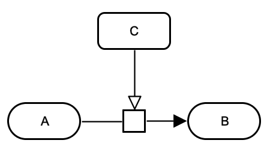

		</td>
		<td style="width:300px; text-align:center;">
			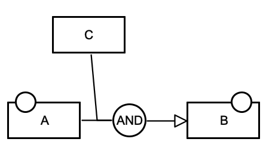
		</td>
	</tr>
	<tr style="font-size:90%">
		<td style="width:300px; text-align:center;">
			<a href="../images/specification/m-sti-m/pd.sbgn">SBGN-ML</a>&ensp;
			<a href="http://web.newteditor.org/?URL=https://www.pd2af.org/images/specification/m-sti-m/pd.sbgn" target="_blank">Newt</a>
		</td>
		<td style="width:300px; text-align:center;">
			<a href="../images/specification/m-sti-m/af.sbgn">SBGN-ML</a>&ensp;
			<a href="http://web.newteditor.org/?URL=https://www.pd2af.org/images/specification/m-sti-m/af.sbgn" target="_blank">Newt</a>
		</td>
	</tr>
</table> 

	

	

   <h3>1.22 m-cat-m</h3>

<table class="rules-table">
	<tr style="font-size:90%">
		<td style="width:300px; text-align:center;">
			
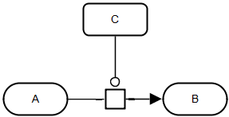

		</td>
		<td style="width:300px; text-align:center;">
			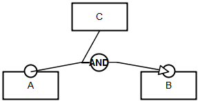
		</td>
	</tr>
	<tr style="font-size:90%">
		<td style="width:300px; text-align:center;">
			<a href="../images/specification/m-cat-m/pd.sbgn">SBGN-ML</a>&ensp;
			<a href="http://web.newteditor.org/?URL=https://www.pd2af.org/images/specification/m-cat-m/pd.sbgn" target="_blank">Newt</a>
		</td>
		<td style="width:300px; text-align:center;">
			<a href="../images/specification/m-cat-m/af.sbgn">SBGN-ML</a>&ensp;
			<a href="http://web.newteditor.org/?URL=https://www.pd2af.org/images/specification/m-cat-m/af.sbgn" target="_blank">Newt</a>
		</td>
	</tr>
</table> 

	

	

   <h3>1.23 m-nsti-m</h3>

<table class="rules-table">
	<tr style="font-size:90%">
		<td style="width:300px; text-align:center;">
			
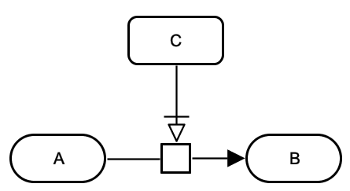

		</td>
		<td style="width:300px; text-align:center;">
			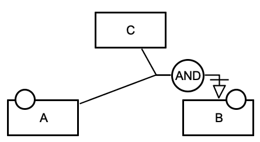
		</td>
	</tr>
	<tr style="font-size:90%">
		<td style="width:300px; text-align:center;">
			<a href="../images/specification/m-nsti-m/pd.sbgn">SBGN-ML</a>&ensp;
			<a href="http://web.newteditor.org/?URL=https://www.pd2af.org/images/specification/m-nsti-m/pd.sbgn" target="_blank">Newt</a>
		</td>
		<td style="width:300px; text-align:center;">
			<a href="../images/specification/m-nsti-m/af.sbgn">SBGN-ML</a>&ensp;
			<a href="http://web.newteditor.org/?URL=https://www.pd2af.org/images/specification/m-nsti-m/af.sbgn" target="_blank">Newt</a>
		</td>
	</tr>
</table> 

	

	

   <h3>1.24 m-mod-m</h3>

<table class="rules-table">
	<tr style="font-size:90%">
		<td style="width:300px; text-align:center;">
			
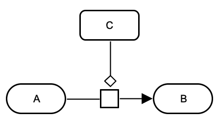

		</td>
		<td style="width:300px; text-align:center;">
			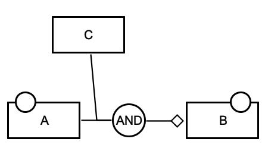
		</td>
	</tr>
	<tr style="font-size:90%">
		<td style="width:300px; text-align:center;">
			<a href="../images/specification/m-mod-m/pd.sbgn">SBGN-ML</a>&ensp;
			<a href="http://web.newteditor.org/?URL=https://www.pd2af.org/images/specification/m-mod-m/pd.sbgn" target="_blank">Newt</a>
		</td>
		<td style="width:300px; text-align:center;">
			<a href="../images/specification/m-mod-m/af.sbgn">SBGN-ML</a>&ensp;
			<a href="http://web.newteditor.org/?URL=https://www.pd2af.org/images/specification/m-mod-m/af.sbgn" target="_blank">Newt</a>
		</td>
	</tr>
</table> 

	

	

   <h3>1.25 m-inh-m</h3>

<table class="rules-table">
	<tr style="font-size:90%">
		<td style="width:300px; text-align:center;">
			
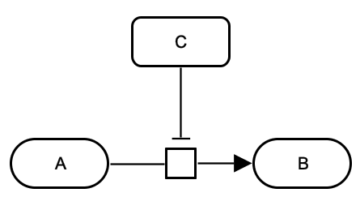

		</td>
		<td style="width:300px; text-align:center;">
			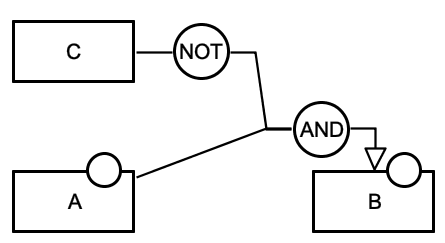
		</td>
	</tr>
	<tr style="font-size:90%">
		<td style="width:300px; text-align:center;">
			<a href="../images/specification/m-inh-m/pd.sbgn">SBGN-ML</a>&ensp;
			<a href="http://web.newteditor.org/?URL=https://www.pd2af.org/images/specification/m-inh-m/pd.sbgn" target="_blank">Newt</a>
		</td>
		<td style="width:300px; text-align:center;">
			<a href="../images/specification/m-inh-m/af.sbgn">SBGN-ML</a>&ensp;
			<a href="http://web.newteditor.org/?URL=https://www.pd2af.org/images/specification/m-inh-m/af.sbgn" target="_blank">Newt</a>
		</td>
	</tr>
</table> 

	
   <h3 style="color:red">1.26 aiaimm-cat-aiiamm</h3> 

	
	
	

   <h3>1.27 a-catr-a</h3>

<table class="rules-table">
	<tr style="font-size:90%">
		<td style="width:300px; text-align:center;">
			
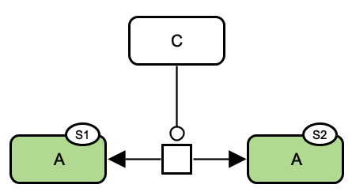

		</td>
		<td style="width:300px; text-align:center;">
			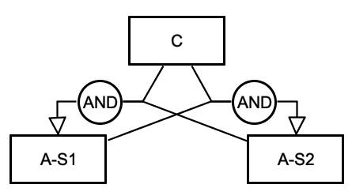
		</td>
	</tr>
	<tr style="font-size:90%">
		<td style="width:300px; text-align:center;">
			<a href="../images/specification/a-catr-a/pd.sbgn">SBGN-ML</a>&ensp;
			<a href="http://web.newteditor.org/?URL=https://www.pd2af.org/images/specification/a-catr-a/pd.sbgn" target="_blank">Newt</a>
		</td>
		<td style="width:300px; text-align:center;">
			<a href="../images/specification/a-catr-a/af.sbgn">SBGN-ML</a>&ensp;
			<a href="http://web.newteditor.org/?URL=https://www.pd2af.org/images/specification/a-catr-a/af.sbgn" target="_blank">Newt</a>
		</td>
	</tr>
</table> 

	

	

   <h3>1.28 a-catr-i</h3>

<table class="rules-table">
	<tr style="font-size:90%">
		<td style="width:300px; text-align:center;">
			
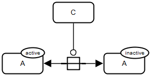

		</td>
		<td style="width:300px; text-align:center;">
			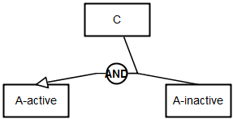
		</td>
	</tr>
	<tr style="font-size:90%">
		<td style="width:300px; text-align:center;">
			<a href="../images/specification/a-catr-i/pd.sbgn">SBGN-ML</a>&ensp;
			<a href="http://web.newteditor.org/?URL=https://www.pd2af.org/images/specification/a-catr-i/pd.sbgn" target="_blank">Newt</a>
		</td>
		<td style="width:300px; text-align:center;">
			<a href="../images/specification/a-catr-i/af.sbgn">SBGN-ML</a>&ensp;
			<a href="http://web.newteditor.org/?URL=https://www.pd2af.org/images/specification/a-catr-i/af.sbgn" target="_blank">Newt</a>
		</td>
	</tr>
</table> 

	

	

   <h3>1.29 i-inhr-a</h3>

<table class="rules-table">
	<tr style="font-size:90%">
		<td style="width:300px; text-align:center;">
			
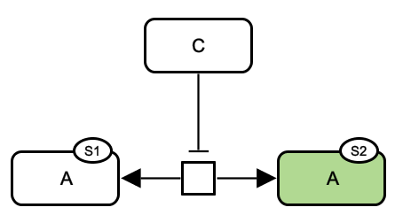

		</td>
		<td style="width:300px; text-align:center;">
			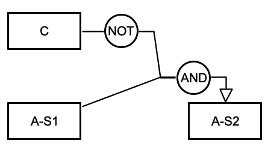
		</td>
	</tr>
	<tr style="font-size:90%">
		<td style="width:300px; text-align:center;">
			<a href="../images/specification/i-inhr-a/pd.sbgn">SBGN-ML</a>&ensp;
			<a href="http://web.newteditor.org/?URL=https://www.pd2af.org/images/specification/i-inhr-a/pd.sbgn" target="_blank">Newt</a>
		</td>
		<td style="width:300px; text-align:center;">
			<a href="../images/specification/i-inhr-a/af.sbgn">SBGN-ML</a>&ensp;
			<a href="http://web.newteditor.org/?URL=https://www.pd2af.org/images/specification/i-inhr-a/af.sbgn" target="_blank">Newt</a>
		</td>
	</tr>
</table> 

	

	

   <h3>1.30 m-catr-m</h3>

<table class="rules-table">
	<tr style="font-size:90%">
		<td style="width:300px; text-align:center;">
			
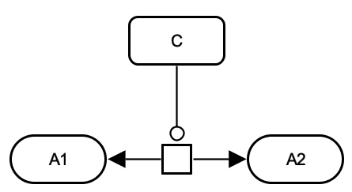

		</td>
		<td style="width:300px; text-align:center;">
			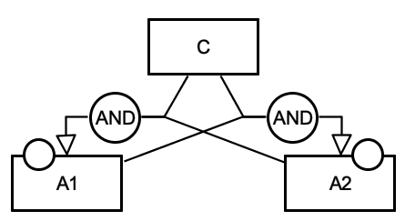
		</td>
	</tr>
	<tr style="font-size:90%">
		<td style="width:300px; text-align:center;">
			<a href="../images/specification/m-catr-m/pd.sbgn">SBGN-ML</a>&ensp;
			<a href="http://web.newteditor.org/?URL=https://www.pd2af.org/images/specification/m-catr-m/pd.sbgn" target="_blank">Newt</a>
		</td>
		<td style="width:300px; text-align:center;">
			<a href="../images/specification/m-catr-m/af.sbgn">SBGN-ML</a>&ensp;
			<a href="http://web.newteditor.org/?URL=https://www.pd2af.org/images/specification/m-catr-m/af.sbgn" target="_blank">Newt</a>
		</td>
	</tr>
</table> 

	

	

   <h3>1.31 m-inhr-m</h3>

<table class="rules-table">
	<tr style="font-size:90%">
		<td style="width:300px; text-align:center;">
			
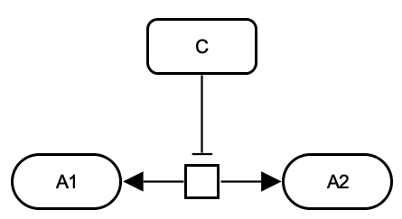

		</td>
		<td style="width:300px; text-align:center;">
			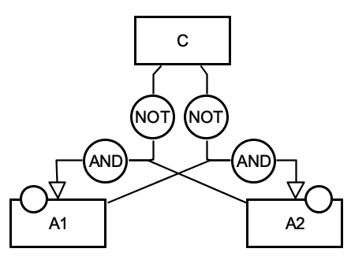
		</td>
	</tr>
	<tr style="font-size:90%">
		<td style="width:300px; text-align:center;">
			<a href="../images/specification/m-inhr-m/pd.sbgn">SBGN-ML</a>&ensp;
			<a href="http://web.newteditor.org/?URL=https://www.pd2af.org/images/specification/m-inhr-m/pd.sbgn" target="_blank">Newt</a>
		</td>
		<td style="width:300px; text-align:center;">
			<a href="../images/specification/m-inhr-m/af.sbgn">SBGN-ML</a>&ensp;
			<a href="http://web.newteditor.org/?URL=https://www.pd2af.org/images/specification/m-inhr-m/af.sbgn" target="_blank">Newt</a>
		</td>
	</tr>
</table> 

	
   <h3 style="color:red">1.32 logical gates</h3> 
   

	
   <h3 style="color:red">1.33 logical gates or</h3> 

   

  </body>
