  <body>
    

   <h1>Translation rules specification</h1>
	
   
Here is the specification for the translation rules. We start from most elementary patterns and follow with increasingly complex ones. All these patterns are also test cases for regression testing of the Converter program. With each case we ensure that converter code translates left-hand diagram exactly to the right-hand diagram, while both being considered as standalone schemes.
 
   

* [Posttranslational modification](#posttranslational-modification)
* [Metabolic reactions](#metabolic-reactions)
* [Source and sink](#source-and-sink)
* [Oligomerisation](#oligomerisation)
* [Complexes](#complexes)
* [Translocation](#translocation)
* [Hidden inhibition](#hidden-inhibition)
* [Simple schemes](#simple-schemes)
* [New schemes](#new-schemes)

## Posttranslational modification

   <h4 style="color:black">1.1 i-sti-i</h4>

<table class="rules-table">
	<tr style="font-size:90%">
		<td style="width:400px; text-align:center;">
			

		</td>
		<td style="width:300px; text-align:center;">
			
		</td>
	</tr>
	<tr style="font-size:90%">
		<td style="width:400px; text-align:center;">
			<a href="../images/specification/i-sti-i/pd.sbgn">SBGN-ML</a>&ensp;
			<a href="http://web.newteditor.org/?URL=https://www.pd2af.org/images/specification/i-sti-i/pd.sbgn" target="_blank">Newt</a>
		</td>
		<td style="width:300px; text-align:center;">
			<a href="../images/specification/i-sti-i/af.sbgn">SBGN-ML</a>&ensp;
			<a href="http://web.newteditor.org/?URL=https://www.pd2af.org/images/specification/i-sti-i/af.sbgn" target="_blank">Newt</a>
		</td>
	</tr>
</table> 

	

	

   <h4 style="color:black">1.2 i-cat-i</h4>

<table class="rules-table">
	<tr>
		<td style="width:300px; text-align:center;">
			

		</td>
		<td style="width:300px; text-align:center;">
			
		</td>
	</tr>
        <tr style="font-size:90%">
		<td style="width:400px; text-align:center;">
			<a href="../images/specification/i-cat-i/pd.sbgn">SBGN-ML</a>&ensp;
			<a href="http://web.newteditor.org/?URL=https://www.pd2af.org/images/specification/i-cat-i/pd.sbgn" target="_blank">Newt</a>
		</td>
		<td style="width:300px; text-align:center;">
			<a href="../images/specification/i-cat-i/af.sbgn">SBGN-ML</a>&ensp;
			<a href="http://web.newteditor.org/?URL=https://www.pd2af.org/images/specification/i-cat-i/af.sbgn" target="_blank">Newt</a>
		</td>
        </tr>
</table> 

	

	

   <h4 style="color:black">1.3 i-nsti-i</h4>

<table class="rules-table">
	<tr style="font-size:90%">
		<td style="width:400px; text-align:center;">
			

		</td>
		<td style="width:300px; text-align:center;">
			
		</td>
	</tr>
	<tr style="font-size:90%">
		<td style="width:400px; text-align:center;">
			<a href="../images/specification/i-nsti-i/pd.sbgn">SBGN-ML</a>&ensp;
			<a href="http://web.newteditor.org/?URL=https://www.pd2af.org/images/specification/i-nsti-i/pd.sbgn" target="_blank">Newt</a>
		</td>
		<td style="width:300px; text-align:center;">
			<a href="../images/specification/i-nsti-i/af.sbgn">SBGN-ML</a>&ensp;
			<a href="http://web.newteditor.org/?URL=https://www.pd2af.org/images/specification/i-nsti-i/af.sbgn" target="_blank">Newt</a>
		</td>
	</tr>
</table> 

	

	

   <h4 style="color:black">1.4 i-mod-i</h4>

<table class="rules-table">
	<tr style="font-size:90%">
		<td style="width:400px; text-align:center;">
			

		</td>
		<td style="width:300px; text-align:center;">
			
		</td>
	</tr>
	<tr style="font-size:90%">
		<td style="width:400px; text-align:center;">
			<a href="../images/specification/i-mod-i/pd.sbgn">SBGN-ML</a>&ensp;
			<a href="http://web.newteditor.org/?URL=https://www.pd2af.org/images/specification/i-mod-i/pd.sbgn" target="_blank">Newt</a>
		</td>
		<td style="width:300px; text-align:center;">
			<a href="../images/specification/i-mod-i/af.sbgn">SBGN-ML</a>&ensp;
			<a href="http://web.newteditor.org/?URL=https://www.pd2af.org/images/specification/i-mod-i/af.sbgn" target="_blank">Newt</a>
		</td>
	</tr>
</table> 
	

	

   <h4 style="color:black">1.5 i-inh-i</h4>

<table class="rules-table">
	<tr style="font-size:90%">
		<td style="width:400px; text-align:center;">
			

		</td>
		<td style="width:300px; text-align:center;">
			
		</td>
	</tr>
	<tr style="font-size:90%">
		<td style="width:400px; text-align:center;">
			<a href="../images/specification/i-inh-i/pd.sbgn">SBGN-ML</a>&ensp;
			<a href="http://web.newteditor.org/?URL=https://www.pd2af.org/images/specification/i-inh-i/pd.sbgn" target="_blank">Newt</a>
		</td>
		<td style="width:300px; text-align:center;">
			<a href="../images/specification/i-inh-i/af.sbgn">SBGN-ML</a>&ensp;
			<a href="http://web.newteditor.org/?URL=https://www.pd2af.org/images/specification/i-inh-i/af.sbgn" target="_blank">Newt</a>
		</td>
	</tr>
</table> 
	

	

   <h4 style="color:black">1.6 i-sti-a</h4>

<table class="rules-table">
	<tr style="font-size:90%">
		<td style="width:400px; text-align:center;">
			

		</td>
		<td style="width:300px; text-align:center;">
			
		</td>
	</tr>
	<tr style="font-size:90%">
		<td style="width:400px; text-align:center;">
			<a href="../images/specification/i-sti-a/pd.sbgn">SBGN-ML</a>&ensp;
			<a href="http://web.newteditor.org/?URL=https://www.pd2af.org/images/specification/i-sti-a/pd.sbgn" target="_blank">Newt</a>
		</td>
		<td style="width:300px; text-align:center;">
			<a href="../images/specification/i-sti-a/af.sbgn">SBGN-ML</a>&ensp;
			<a href="http://web.newteditor.org/?URL=https://www.pd2af.org/images/specification/i-sti-a/af.sbgn" target="_blank">Newt</a>
		</td>
	</tr>
</table> 
	

	

   <h4 style="color:black">1.7 i-cat-a</h4>

<table class="rules-table">
	<tr style="font-size:90%">
		<td style="width:400px; text-align:center;">
			

		</td>
		<td style="width:300px; text-align:center;">
			
		</td>
	</tr>
	<tr style="font-size:90%">
		<td style="width:400px; text-align:center;">
			<a href="../images/specification/i-cat-a/pd.sbgn">SBGN-ML</a>&ensp;
			<a href="http://web.newteditor.org/?URL=https://www.pd2af.org/images/specification/i-cat-a/pd.sbgn" target="_blank">Newt</a>
		</td>
		<td style="width:300px; text-align:center;">
			<a href="../images/specification/i-cat-a/af.sbgn">SBGN-ML</a>&ensp;
			<a href="http://web.newteditor.org/?URL=https://www.pd2af.org/images/specification/i-cat-a/af.sbgn" target="_blank">Newt</a>
		</td>
	</tr>
</table> 

	

	

   <h4 style="color:black">1.8 i-nsti-a</h4>

<table class="rules-table">
	<tr style="font-size:90%">
		<td style="width:400px; text-align:center;">
			

		</td>
		<td style="width:300px; text-align:center;">
			
		</td>
	</tr>
	<tr style="font-size:90%">
		<td style="width:400px; text-align:center;">
			<a href="../images/specification/i-nsti-a/pd.sbgn">SBGN-ML</a>&ensp;
			<a href="http://web.newteditor.org/?URL=https://www.pd2af.org/images/specification/i-nsti-a/pd.sbgn" target="_blank">Newt</a>
		</td>
		<td style="width:300px; text-align:center;">
			<a href="../images/specification/i-nsti-a/af.sbgn">SBGN-ML</a>&ensp;
			<a href="http://web.newteditor.org/?URL=https://www.pd2af.org/images/specification/i-nsti-a/af.sbgn" target="_blank">Newt</a>
		</td>
	</tr>
</table> 

	

	

   <h4 style="color:black">1.9 i-mod-a</h4>

<table class="rules-table">
	<tr style="font-size:90%">
		<td style="width:400px; text-align:center;">
			

		</td>
		<td style="width:300px; text-align:center;">
			
		</td>
	</tr>
	<tr style="font-size:90%">
		<td style="width:400px; text-align:center;">
			<a href="../images/specification/i-mod-a/pd.sbgn">SBGN-ML</a>&ensp;
			<a href="http://web.newteditor.org/?URL=https://www.pd2af.org/images/specification/i-mod-a/pd.sbgn" target="_blank">Newt</a>
		</td>
		<td style="width:300px; text-align:center;">
			<a href="../images/specification/i-mod-a/af.sbgn">SBGN-ML</a>&ensp;
			<a href="http://web.newteditor.org/?URL=https://www.pd2af.org/images/specification/i-mod-a/af.sbgn" target="_blank">Newt</a>
		</td>
	</tr>
</table> 

	

	

   <h4 style="color:black">1.10 i-inh-a</h4>

<table class="rules-table">
	<tr style="font-size:90%">
		<td style="width:400px; text-align:center;">
			

		</td>
		<td style="width:300px; text-align:center;">
			
		</td>
	</tr>
	<tr style="font-size:90%">
		<td style="width:400px; text-align:center;">
			<a href="../images/specification/i-inh-a/pd.sbgn">SBGN-ML</a>&ensp;
			<a href="http://web.newteditor.org/?URL=https://www.pd2af.org/images/specification/i-inh-a/pd.sbgn" target="_blank">Newt</a>
		</td>
		<td style="width:300px; text-align:center;">
			<a href="../images/specification/i-inh-a/af.sbgn">SBGN-ML</a>&ensp;
			<a href="http://web.newteditor.org/?URL=https://www.pd2af.org/images/specification/i-inh-a/af.sbgn" target="_blank">Newt</a>
		</td>
	</tr>
</table> 

	

	

   <h4 style="color:black">1.11 a-sti-i</h4>

<table class="rules-table">
	<tr style="font-size:90%">
		<td style="width:400px; text-align:center;">
			

		</td>
		<td style="width:300px; text-align:center;">
			
		</td>
	</tr>
	<tr style="font-size:90%">
		<td style="width:400px; text-align:center;">
			<a href="../images/specification/a-sti-i/pd.sbgn">SBGN-ML</a>&ensp;
			<a href="http://web.newteditor.org/?URL=https://www.pd2af.org/images/specification/a-sti-i/pd.sbgn" target="_blank">Newt</a>
		</td>
		<td style="width:300px; text-align:center;">
			<a href="../images/specification/a-sti-i/af.sbgn">SBGN-ML</a>&ensp;
			<a href="http://web.newteditor.org/?URL=https://www.pd2af.org/images/specification/a-sti-i/af.sbgn" target="_blank">Newt</a>
		</td>
	</tr>
</table> 
	

	

   <h4 style="color:black">1.12 a-cat-i</h4>

<table class="rules-table">
	<tr style="font-size:90%">
		<td style="width:400px; text-align:center;">
			

		</td>
		<td style="width:300px; text-align:center;">
			
		</td>
	</tr>
	<tr style="font-size:90%">
		<td style="width:400px; text-align:center;">
			<a href="../images/specification/a-cat-i/pd.sbgn">SBGN-ML</a>&ensp;
			<a href="http://web.newteditor.org/?URL=https://www.pd2af.org/images/specification/a-cat-i/pd.sbgn" target="_blank">Newt</a>
		</td>
		<td style="width:300px; text-align:center;">
			<a href="../images/specification/a-cat-i/af.sbgn">SBGN-ML</a>&ensp;
			<a href="http://web.newteditor.org/?URL=https://www.pd2af.org/images/specification/a-cat-i/af.sbgn" target="_blank">Newt</a>
		</td>
	</tr>
</table> 

	

	

   <h4 style="color:black">11.13 a-nsti-i</h4>

<table class="rules-table">
	<tr style="font-size:90%">
		<td style="width:400px; text-align:center;">
			

		</td>
		<td style="width:300px; text-align:center;">
			
		</td>
	</tr>
	<tr style="font-size:90%">
		<td style="width:400px; text-align:center;">
			<a href="../images/specification/a-nsti-i/pd.sbgn">SBGN-ML</a>&ensp;
			<a href="http://web.newteditor.org/?URL=https://www.pd2af.org/images/specification/a-nsti-i/pd.sbgn" target="_blank">Newt</a>
		</td>
		<td style="width:300px; text-align:center;">
			<a href="../images/specification/a-nsti-i/af.sbgn">SBGN-ML</a>&ensp;
			<a href="http://web.newteditor.org/?URL=https://www.pd2af.org/images/specification/a-nsti-i/af.sbgn" target="_blank">Newt</a>
		</td>
	</tr>
</table> 

	

	

   <h4 style="color:black">1.14 a-mod-i</h4>

<table class="rules-table">
	<tr style="font-size:90%">
		<td style="width:400px; text-align:center;">
			

		</td>
		<td style="width:300px; text-align:center;">
			
		</td>
	</tr>
	<tr style="font-size:90%">
		<td style="width:400px; text-align:center;">
			<a href="../images/specification/a-mod-i/pd.sbgn">SBGN-ML</a>&ensp;
			<a href="http://web.newteditor.org/?URL=https://www.pd2af.org/images/specification/a-mod-i/pd.sbgn" target="_blank">Newt</a>
		</td>
		<td style="width:300px; text-align:center;">
			<a href="../images/specification/a-mod-i/af.sbgn">SBGN-ML</a>&ensp;
			<a href="http://web.newteditor.org/?URL=https://www.pd2af.org/images/specification/a-mod-i/af.sbgn" target="_blank">Newt</a>
		</td>
	</tr>
</table> 

	

	

   <h4 style="color:black">1.15 a-inh-i</h4>

<table class="rules-table">
	<tr style="font-size:90%">
		<td style="width:400px; text-align:center;">
			

		</td>
		<td style="width:300px; text-align:center;">
			
		</td>
	</tr>
	<tr style="font-size:90%">
		<td style="width:400px; text-align:center;">
			<a href="../images/specification/a-inh-i/pd.sbgn">SBGN-ML</a>&ensp;
			<a href="http://web.newteditor.org/?URL=https://www.pd2af.org/images/specification/a-inh-i/pd.sbgn" target="_blank">Newt</a>
		</td>
		<td style="width:300px; text-align:center;">
			<a href="../images/specification/a-inh-i/af.sbgn">SBGN-ML</a>&ensp;
			<a href="http://web.newteditor.org/?URL=https://www.pd2af.org/images/specification/a-inh-i/af.sbgn" target="_blank">Newt</a>
		</td>
	</tr>
</table> 

	

	

   <h4 style="color:black">1.16 a-sti-a</h4>

<table class="rules-table">
	<tr style="font-size:90%">
		<td style="width:400px; text-align:center;">
			

		</td>
		<td style="width:300px; text-align:center;">
			
		</td>
	</tr>
	<tr style="font-size:90%">
		<td style="width:400px; text-align:center;">
			<a href="../images/specification/a-sti-a/pd.sbgn">SBGN-ML</a>&ensp;
			<a href="http://web.newteditor.org/?URL=https://www.pd2af.org/images/specification/a-sti-a/pd.sbgn" target="_blank">Newt</a>
		</td>
		<td style="width:300px; text-align:center;">
			<a href="../images/specification/a-sti-a/af.sbgn">SBGN-ML</a>&ensp;
			<a href="http://web.newteditor.org/?URL=https://www.pd2af.org/images/specification/a-sti-a/af.sbgn" target="_blank">Newt</a>
		</td>
	</tr>
</table> 
	

	

   <h4 style="color:black">1.17 a-cat-a</h4>

<table class="rules-table">
	<tr style="font-size:90%">
		<td style="width:400px; text-align:center;">
			

		</td>
		<td style="width:300px; text-align:center;">
			
		</td>
	</tr>
	<tr style="font-size:90%">
		<td style="width:400px; text-align:center;">
			<a href="../images/specification/a-cat-a/pd.sbgn">SBGN-ML</a>&ensp;
			<a href="http://web.newteditor.org/?URL=https://www.pd2af.org/images/specification/a-cat-a/pd.sbgn" target="_blank">Newt</a>
		</td>
		<td style="width:300px; text-align:center;">
			<a href="../images/specification/a-cat-a/af.sbgn">SBGN-ML</a>&ensp;
			<a href="http://web.newteditor.org/?URL=https://www.pd2af.org/images/specification/a-cat-a/af.sbgn" target="_blank">Newt</a>
		</td>
	</tr>
</table> 

	

	

   <h4 style="color:black">1.18 a-nsti-a</h4>

<table class="rules-table">
	<tr style="font-size:90%">
		<td style="width:400px; text-align:center;">
			

		</td>
		<td style="width:300px; text-align:center;">
			
		</td>
	</tr>
	<tr style="font-size:90%">
		<td style="width:400px; text-align:center;">
			<a href="../images/specification/a-nsti-a/pd.sbgn">SBGN-ML</a>&ensp;
			<a href="http://web.newteditor.org/?URL=https://www.pd2af.org/images/specification/a-nsti-a/pd.sbgn" target="_blank">Newt</a>
		</td>
		<td style="width:300px; text-align:center;">
			<a href="../images/specification/a-nsti-a/af.sbgn">SBGN-ML</a>&ensp;
			<a href="http://web.newteditor.org/?URL=https://www.pd2af.org/images/specification/a-nsti-a/af.sbgn" target="_blank">Newt</a>
		</td>
	</tr>
</table> 

	

	

   <h4 style="color:black">1.19 a-mod-a</h4>

<table class="rules-table">
	<tr style="font-size:90%">
		<td style="width:400px; text-align:center;">
			

		</td>
		<td style="width:300px; text-align:center;">
			
		</td>
	</tr>
	<tr style="font-size:90%">
		<td style="width:400px; text-align:center;">
			<a href="../images/specification/a-mod-a/pd.sbgn">SBGN-ML</a>&ensp;
			<a href="http://web.newteditor.org/?URL=https://www.pd2af.org/images/specification/a-mod-a/pd.sbgn" target="_blank">Newt</a>
		</td>
	<td style="width:300px; text-align:center;">
			<a href="../images/specification/a-mod-a/af.sbgn">SBGN-ML</a>&ensp;
			<a href="http://web.newteditor.org/?URL=https://www.pd2af.org/images/specification/a-mod-a/af.sbgn" target="_blank">Newt</a>
		</td>
	</tr>
</table> 

	

	

   <h4 style="color:black">1.20 a-inh-a</h4>

<table class="rules-table">
	<tr style="font-size:90%">
		<td style="width:400px; text-align:center;">
			

		</td>
		<td style="width:300px; text-align:center;">
			
		</td>
	</tr>
	<tr style="font-size:90%">
		<td style="width:400px; text-align:center;">
			<a href="../images/specification/a-inh-a/pd.sbgn">SBGN-ML</a>&ensp;
			<a href="http://web.newteditor.org/?URL=https://www.pd2af.org/images/specification/a-inh-a/pd.sbgn" target="_blank">Newt</a>
		</td>
		<td style="width:300px; text-align:center;">
			<a href="../images/specification/a-inh-a/af.sbgn">SBGN-ML</a>&ensp;
			<a href="http://web.newteditor.org/?URL=https://www.pd2af.org/images/specification/a-inh-a/af.sbgn" target="_blank">Newt</a>
		</td>
	</tr>
</table>   

## Metabolic reactions

   <h4 style="color:black">1.21 m-sti-m</h4>

<table class="rules-table">
	<tr style="font-size:90%">
		<td style="width:400px; text-align:center;">
			

		</td>
		<td style="width:300px; text-align:center;">
			
		</td>
	</tr>
	<tr style="font-size:90%">
		<td style="width:400px; text-align:center;">
			<a href="../images/specification/m-sti-m/pd.sbgn">SBGN-ML</a>&ensp;
			<a href="http://web.newteditor.org/?URL=https://www.pd2af.org/images/specification/m-sti-m/pd.sbgn" target="_blank">Newt</a>
		</td>
		<td style="width:300px; text-align:center;">
			<a href="../images/specification/m-sti-m/af.sbgn">SBGN-ML</a>&ensp;
			<a href="http://web.newteditor.org/?URL=https://www.pd2af.org/images/specification/m-sti-m/af.sbgn" target="_blank">Newt</a>
		</td>
	</tr>
</table> 

	

	

   <h4 style="color:black">1.22 m-cat-m</h4>

<table class="rules-table">
	<tr style="font-size:90%">
		<td style="width:400px; text-align:center;">
			

		</td>
		<td style="width:300px; text-align:center;">
			
		</td>
	</tr>
	<tr style="font-size:90%">
		<td style="width:400px; text-align:center;">
			<a href="../images/specification/m-cat-m/pd.sbgn">SBGN-ML</a>&ensp;
			<a href="http://web.newteditor.org/?URL=https://www.pd2af.org/images/specification/m-cat-m/pd.sbgn" target="_blank">Newt</a>
		</td>
		<td style="width:300px; text-align:center;">
			<a href="../images/specification/m-cat-m/af.sbgn">SBGN-ML</a>&ensp;
			<a href="http://web.newteditor.org/?URL=https://www.pd2af.org/images/specification/m-cat-m/af.sbgn" target="_blank">Newt</a>
		</td>
	</tr>
</table> 

	

	

   <h4 style="color:black">1.23 m-nsti-m</h4>

<table class="rules-table">
	<tr style="font-size:90%">
		<td style="width:400px; text-align:center;">
			

		</td>
		<td style="width:300px; text-align:center;">
			
		</td>
	</tr>
	<tr style="font-size:90%">
		<td style="width:400px; text-align:center;">
			<a href="../images/specification/m-nsti-m/pd.sbgn">SBGN-ML</a>&ensp;
			<a href="http://web.newteditor.org/?URL=https://www.pd2af.org/images/specification/m-nsti-m/pd.sbgn" target="_blank">Newt</a>
		</td>
		<td style="width:300px; text-align:center;">
			<a href="../images/specification/m-nsti-m/af.sbgn">SBGN-ML</a>&ensp;
			<a href="http://web.newteditor.org/?URL=https://www.pd2af.org/images/specification/m-nsti-m/af.sbgn" target="_blank">Newt</a>
		</td>
	</tr>
</table> 

	

	

   <h4 style="color:black">1.24 m-mod-m</h4>

<table class="rules-table">
	<tr style="font-size:90%">
		<td style="width:400px; text-align:center;">
			

		</td>
		<td style="width:300px; text-align:center;">
			
		</td>
	</tr>
	<tr style="font-size:90%">
		<td style="width:400px; text-align:center;">
			<a href="../images/specification/m-mod-m/pd.sbgn">SBGN-ML</a>&ensp;
			<a href="http://web.newteditor.org/?URL=https://www.pd2af.org/images/specification/m-mod-m/pd.sbgn" target="_blank">Newt</a>
		</td>
		<td style="width:300px; text-align:center;">
			<a href="../images/specification/m-mod-m/af.sbgn">SBGN-ML</a>&ensp;
			<a href="http://web.newteditor.org/?URL=https://www.pd2af.org/images/specification/m-mod-m/af.sbgn" target="_blank">Newt</a>
		</td>
	</tr>
</table> 

	

	

   <h4 style="color:black">1.25 m-inh-m</h4>

<table class="rules-table">
	<tr style="font-size:90%">
		<td style="width:400px; text-align:center;">
			

		</td>
		<td style="width:300px; text-align:center;">
			
		</td>
	</tr>
	<tr style="font-size:90%">
		<td style="width:400px; text-align:center;">
			<a href="../images/specification/m-inh-m/pd.sbgn">SBGN-ML</a>&ensp;
			<a href="http://web.newteditor.org/?URL=https://www.pd2af.org/images/specification/m-inh-m/pd.sbgn" target="_blank">Newt</a>
		</td>
		<td style="width:300px; text-align:center;">
			<a href="../images/specification/m-inh-m/af.sbgn">SBGN-ML</a>&ensp;
			<a href="http://web.newteditor.org/?URL=https://www.pd2af.org/images/specification/m-inh-m/af.sbgn" target="_blank">Newt</a>
		</td>
	</tr>
</table> 

	
	
	

   <h4 style="color:black">1.27 a-catr-a</h4>

<table class="rules-table">
	<tr style="font-size:90%">
		<td style="width:400px; text-align:center;">
			

		</td>
		<td style="width:300px; text-align:center;">
			
		</td>
	</tr>
	<tr style="font-size:90%">
		<td style="width:400px; text-align:center;">
			<a href="../images/specification/a-catr-a/pd.sbgn">SBGN-ML</a>&ensp;
			<a href="http://web.newteditor.org/?URL=https://www.pd2af.org/images/specification/a-catr-a/pd.sbgn" target="_blank">Newt</a>
		</td>
		<td style="width:300px; text-align:center;">
			<a href="../images/specification/a-catr-a/af.sbgn">SBGN-ML</a>&ensp;
			<a href="http://web.newteditor.org/?URL=https://www.pd2af.org/images/specification/a-catr-a/af.sbgn" target="_blank">Newt</a>
		</td>
	</tr>
</table> 

	

	

   <h4 style="color:black">1.28 a-catr-i</h4>

<table class="rules-table">
	<tr style="font-size:90%">
		<td style="width:400px; text-align:center;">
			

		</td>
		<td style="width:300px; text-align:center;">
			
		</td>
	</tr>
	<tr style="font-size:90%">
		<td style="width:400px; text-align:center;">
			<a href="../images/specification/a-catr-i/pd.sbgn">SBGN-ML</a>&ensp;
			<a href="http://web.newteditor.org/?URL=https://www.pd2af.org/images/specification/a-catr-i/pd.sbgn" target="_blank">Newt</a>
		</td>
		<td style="width:300px; text-align:center;">
			<a href="../images/specification/a-catr-i/af.sbgn">SBGN-ML</a>&ensp;
			<a href="http://web.newteditor.org/?URL=https://www.pd2af.org/images/specification/a-catr-i/af.sbgn" target="_blank">Newt</a>
		</td>
	</tr>
</table> 

	

	

   <h4 style="color:black">1.29 i-inhr-a</h4>

<table class="rules-table">
	<tr style="font-size:90%">
		<td style="width:400px; text-align:center;">
			

		</td>
		<td style="width:300px; text-align:center;">
			
		</td>
	</tr>
	<tr style="font-size:90%">
		<td style="width:400px; text-align:center;">
			<a href="../images/specification/i-inhr-a/pd.sbgn">SBGN-ML</a>&ensp;
			<a href="http://web.newteditor.org/?URL=https://www.pd2af.org/images/specification/i-inhr-a/pd.sbgn" target="_blank">Newt</a>
		</td>
		<td style="width:300px; text-align:center;">
			<a href="../images/specification/i-inhr-a/af.sbgn">SBGN-ML</a>&ensp;
			<a href="http://web.newteditor.org/?URL=https://www.pd2af.org/images/specification/i-inhr-a/af.sbgn" target="_blank">Newt</a>
		</td>
	</tr>
</table> 

	

	

   <h4 style="color:black">1.30 m-catr-m</h4>

<table class="rules-table">
	<tr style="font-size:90%">
		<td style="width:400px; text-align:center;">
			

		</td>
		<td style="width:300px; text-align:center;">
			
		</td>
	</tr>
	<tr style="font-size:90%">
		<td style="width:400px; text-align:center;">
			<a href="../images/specification/m-catr-m/pd.sbgn">SBGN-ML</a>&ensp;
			<a href="http://web.newteditor.org/?URL=https://www.pd2af.org/images/specification/m-catr-m/pd.sbgn" target="_blank">Newt</a>
		</td>
		<td style="width:300px; text-align:center;">
			<a href="../images/specification/m-catr-m/af.sbgn">SBGN-ML</a>&ensp;
			<a href="http://web.newteditor.org/?URL=https://www.pd2af.org/images/specification/m-catr-m/af.sbgn" target="_blank">Newt</a>
		</td>
	</tr>
</table> 

	

	

   <h4 style="color:black">1.31 m-inhr-m</h4>

<table class="rules-table">
	<tr style="font-size:90%">
		<td style="width:400px; text-align:center;">
			

		</td>
		<td style="width:300px; text-align:center;">
			
		</td>
	</tr>
	<tr style="font-size:90%">
		<td style="width:400px; text-align:center;">
			<a href="../images/specification/m-inhr-m/pd.sbgn">SBGN-ML</a>&ensp;
			<a href="http://web.newteditor.org/?URL=https://www.pd2af.org/images/specification/m-inhr-m/pd.sbgn" target="_blank">Newt</a>
		</td>
		<td style="width:300px; text-align:center;">
			<a href="../images/specification/m-inhr-m/af.sbgn">SBGN-ML</a>&ensp;
			<a href="http://web.newteditor.org/?URL=https://www.pd2af.org/images/specification/m-inhr-m/af.sbgn" target="_blank">Newt</a>
		</td>
	</tr>
</table> 
   
   
   
   
   
## Source and sink
	

	

   <h4 style="color:black">2.1 ss-sti-i</h4>

<table class="rules-table">
	<tr style="font-size:90%">
		<td style="width:400px; text-align:center;">
			
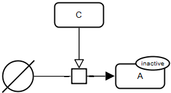

		</td>
		<td style="width:300px; text-align:center;">
			
		</td>
	</tr>
	<tr style="font-size:90%">
		<td style="width:400px; text-align:center;">
			<a href="../images/specification/ss-sti-i/pd.sbgn">SBGN-ML</a>&ensp;
			<a href="http://web.newteditor.org/?URL=https://www.pd2af.org/images/specification/ss-sti-i/pd.sbgn" target="_blank">Newt</a>
		</td>
		<td style="width:300px; text-align:center;">
			<a href="../images/specification/ss-sti-i/af.sbgn">SBGN-ML</a>&ensp;
			<a href="http://web.newteditor.org/?URL=https://www.pd2af.org/images/specification/ss-sti-i/af.sbgn" target="_blank">Newt</a>
		</td>
	</tr>
</table> 

	

	

   <h4 style="color:black">2.2 i-sti-ss</h4>

<table class="rules-table">
	<tr style="font-size:90%">
		<td style="width:400px; text-align:center;">
			
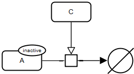

		</td>
		<td style="width:300px; text-align:center;">
			
		</td>
	</tr>
	<tr style="font-size:90%">
		<td style="width:400px; text-align:center;">
			<a href="../images/specification/i-sti-ss/pd.sbgn">SBGN-ML</a>&ensp;
			<a href="http://web.newteditor.org/?URL=https://www.pd2af.org/images/specification/i-sti-ss/pd.sbgn" target="_blank">Newt</a>
		</td>
		<td style="width:300px; text-align:center;">
			<a href="../images/specification/i-sti-ss/af.sbgn">SBGN-ML</a>&ensp;
			<a href="http://web.newteditor.org/?URL=https://www.pd2af.org/images/specification/i-sti-ss/af.sbgn" target="_blank">Newt</a>
		</td>
	</tr>
</table> 

	

	

   <h4 style="color:black">2.3 a-cat-ss</h4>

<table class="rules-table">
	<tr style="font-size:90%">
		<td style="width:400px; text-align:center;">
			
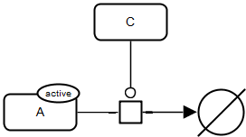

		</td>
		<td style="width:300px; text-align:center;">
			
		</td>
	</tr>
	<tr style="font-size:90%">
		<td style="width:400px; text-align:center;">
			<a href="../images/specification/a-cat-ss/pd.sbgn">SBGN-ML</a>&ensp;
			<a href="http://web.newteditor.org/?URL=https://www.pd2af.org/images/specification/a-cat-ss/pd.sbgn" target="_blank">Newt</a>
		</td>
		<td style="width:300px; text-align:center;">
			<a href="../images/specification/a-cat-ss/af.sbgn">SBGN-ML</a>&ensp;
			<a href="http://web.newteditor.org/?URL=https://www.pd2af.org/images/specification/a-cat-ss/af.sbgn" target="_blank">Newt</a>
		</td>
	</tr>
</table> 

	

	

   <h4 style="color:black">2.4 a-inh-ss</h4>

<table class="rules-table">
	<tr style="font-size:90%">
		<td style="width:400px; text-align:center;">
			
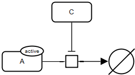

		</td>
		<td style="width:300px; text-align:center;">
			
		</td>
	</tr>
	<tr style="font-size:90%">
		<td style="width:400px; text-align:center;">
			<a href="../images/specification/a-inh-ss/pd.sbgn">SBGN-ML</a>&ensp;
			<a href="http://web.newteditor.org/?URL=https://www.pd2af.org/images/specification/a-inh-ss/pd.sbgn" target="_blank">Newt</a>
		</td>
		<td style="width:300px; text-align:center;">
			<a href="../images/specification/a-inh-ss/af.sbgn">SBGN-ML</a>&ensp;
			<a href="http://web.newteditor.org/?URL=https://www.pd2af.org/images/specification/a-inh-ss/af.sbgn" target="_blank">Newt</a>
		</td>
	</tr>
</table>   
   
   
   
   
   
## Oligomerisation
	

	

   <h4 style="color:black">3.1 Dimerization x2</h4>

<table class="rules-table">
	<tr style="font-size:90%">
		<td style="width:400px; text-align:center;">
			

		</td>
		<td style="width:300px; text-align:center;">
			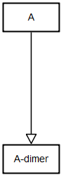
		</td>
	</tr>
	<tr style="font-size:90%">
		<td style="width:400px; text-align:center;">
			<a href="../images/specification/dimerization_x2/pd.sbgn">SBGN-ML</a>&ensp;
			<a href="http://web.newteditor.org/?URL=https://www.pd2af.org/images/specification/dimerization_x2/pd.sbgn" target="_blank">Newt</a>
		</td>
		<td style="width:300px; text-align:center;">
			<a href="../images/specification/dimerization_x2/af.sbgn">SBGN-ML</a>&ensp;
			<a href="http://web.newteditor.org/?URL=https://www.pd2af.org/images/specification/dimerization_x2/af.sbgn" target="_blank">Newt</a>
		</td>
	</tr>
</table> 
	

	

   <h4 style="color:black">3.2 Oligomerization x3</h4>

<table class="rules-table">
	<tr style="font-size:90%">
		<td style="width:400px; text-align:center;">
			
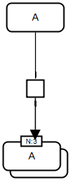

		</td>
		<td style="width:300px; text-align:center;">
			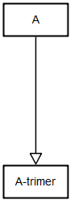
		</td>
	</tr>
	<tr style="font-size:90%">
		<td style="width:400px; text-align:center;">
			<a href="../images/specification/oligomerization_x3/pd.sbgn">SBGN-ML</a>&ensp;
			<a href="http://web.newteditor.org/?URL=https://www.pd2af.org/images/specification/oligomerization_x3/pd.sbgn" target="_blank">Newt</a>
		</td>
		<td style="width:300px; text-align:center;">
			<a href="../images/specification/oligomerization_x3/af.sbgn">SBGN-ML</a>&ensp;
			<a href="http://web.newteditor.org/?URL=https://www.pd2af.org/images/specification/oligomerization_x3/af.sbgn" target="_blank">Newt</a>
		</td>
	</tr>
</table> 
	

	

   <h4 style="color:black">3.3 Oligomerization x4</h4>

<table class="rules-table">
	<tr style="font-size:90%">
		<td style="width:400px; text-align:center;">
			
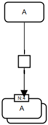

		</td>
		<td style="width:300px; text-align:center;">
			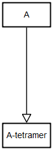
		</td>
	</tr>
	<tr style="font-size:90%">
		<td style="width:400px; text-align:center;">
			<a href="../images/specification/oligomerization_x4/pd.sbgn">SBGN-ML</a>&ensp;
			<a href="http://web.newteditor.org/?URL=https://www.pd2af.org/images/specification/oligomerization_x4/pd.sbgn" target="_blank">Newt</a>
		</td>
		<td style="width:300px; text-align:center;">
			<a href="../images/specification/oligomerization_x4/af.sbgn">SBGN-ML</a>&ensp;
			<a href="http://web.newteditor.org/?URL=https://www.pd2af.org/images/specification/oligomerization_x4/af.sbgn" target="_blank">Newt</a>
		</td>
	</tr>
</table> 
	

	

   <h4 style="color:black">3.4 Oligomerization x5</h4>

<table class="rules-table">
	<tr style="font-size:90%">
		<td style="width:400px; text-align:center;">
			
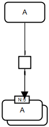

		</td>
		<td style="width:300px; text-align:center;">
			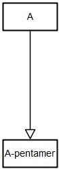
		</td>
	</tr>
	<tr style="font-size:90%">
		<td style="width:400px; text-align:center;">
			<a href="../images/specification/oligomerization_x5/pd.sbgn">SBGN-ML</a>&ensp;
			<a href="http://web.newteditor.org/?URL=https://www.pd2af.org/images/specification/oligomerization_x5/pd.sbgn" target="_blank">Newt</a>
		</td>
		<td style="width:300px; text-align:center;">
			<a href="../images/specification/oligomerization_x5/af.sbgn">SBGN-ML</a>&ensp;
			<a href="http://web.newteditor.org/?URL=https://www.pd2af.org/images/specification/oligomerization_x5/af.sbgn" target="_blank">Newt</a>
		</td>
	</tr>
</table> 
	

	

   <h4 style="color:black">3.5 Oligomerization x6</h4>

<table class="rules-table">
	<tr style="font-size:90%">
		<td style="width:400px; text-align:center;">
			

		</td>
		<td style="width:300px; text-align:center;">
			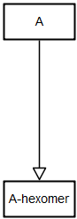
		</td>
	</tr>
	<tr style="font-size:90%">
		<td style="width:400px; text-align:center;">
			<a href="../images/specification/oligomerization_x6/pd.sbgn">SBGN-ML</a>&ensp;
			<a href="http://web.newteditor.org/?URL=https://www.pd2af.org/images/specification/oligomerization_x6/pd.sbgn" target="_blank">Newt</a>
		</td>
		<td style="width:300px; text-align:center;">
			<a href="../images/specification/oligomerization_x6/af.sbgn">SBGN-ML</a>&ensp;
			<a href="http://web.newteditor.org/?URL=https://www.pd2af.org/images/specification/oligomerization_x6/af.sbgn" target="_blank">Newt</a>
		</td>
	</tr>
</table> 
	

	

   <h4 style="color:black">3.6 Oligomerization x7</h4>

<table class="rules-table">
	<tr style="font-size:90%">
		<td style="width:400px; text-align:center;">
			
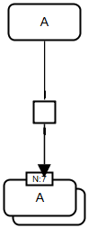

		</td>
		<td style="width:300px; text-align:center;">
			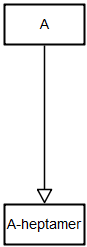
		</td>
	</tr>
	<tr style="font-size:90%">
		<td style="width:400px; text-align:center;">
			<a href="../images/specification/oligomerization_x7/pd.sbgn">SBGN-ML</a>&ensp;
			<a href="http://web.newteditor.org/?URL=https://www.pd2af.org/images/specification/oligomerization_x7/pd.sbgn" target="_blank">Newt</a>
		</td>
		<td style="width:300px; text-align:center;">
			<a href="../images/specification/oligomerization_x7/af.sbgn">SBGN-ML</a>&ensp;
			<a href="http://web.newteditor.org/?URL=https://www.pd2af.org/images/specification/oligomerization_x7/af.sbgn" target="_blank">Newt</a>
		</td>
	</tr>
</table> 
	

	

   <h4 style="color:black">3.7 Oligomerization x8</h4>

<table class="rules-table">
	<tr style="font-size:90%">
		<td style="width:400px; text-align:center;">
			
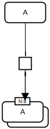

		</td>
		<td style="width:300px; text-align:center;">
			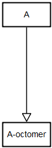
		</td>
	</tr>
	<tr style="font-size:90%">
		<td style="width:400px; text-align:center;">
			<a href="../images/specification/oligomerization_x8/pd.sbgn">SBGN-ML</a>&ensp;
			<a href="http://web.newteditor.org/?URL=https://www.pd2af.org/images/specification/oligomerization_x8/pd.sbgn" target="_blank">Newt</a>
		</td>
		<td style="width:300px; text-align:center;">
			<a href="../images/specification/oligomerization_x8/af.sbgn">SBGN-ML</a>&ensp;
			<a href="http://web.newteditor.org/?URL=https://www.pd2af.org/images/specification/oligomerization_x8/af.sbgn" target="_blank">Newt</a>
		</td>
	</tr>
</table> 
	

	

   <h4 style="color:black">3.8 Oligomerization x9</h4>

<table class="rules-table">
	<tr style="font-size:90%">
		<td style="width:400px; text-align:center;">
			

		</td>
		<td style="width:300px; text-align:center;">
			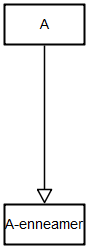
		</td>
	</tr>
	<tr style="font-size:90%">
		<td style="width:400px; text-align:center;">
			<a href="../images/specification/oligomerization_x9/pd.sbgn">SBGN-ML</a>&ensp;
			<a href="http://web.newteditor.org/?URL=https://www.pd2af.org/images/specification/oligomerization_x9/pd.sbgn" target="_blank">Newt</a>
		</td>
		<td style="width:300px; text-align:center;">
			<a href="../images/specification/oligomerization_x9/af.sbgn">SBGN-ML</a>&ensp;
			<a href="http://web.newteditor.org/?URL=https://www.pd2af.org/images/specification/oligomerization_x9/af.sbgn" target="_blank">Newt</a>
		</td>
	</tr>
</table> 
	

	

   <h4 style="color:black">3.9 Oligomerization x10</h4>

<table class="rules-table">
	<tr style="font-size:90%">
		<td style="width:400px; text-align:center;">
			
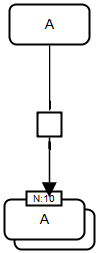

		</td>
		<td style="width:300px; text-align:center;">
			
		</td>
	</tr>
	<tr style="font-size:90%">
		<td style="width:400px; text-align:center;">
			<a href="../images/specification/oligomerization_x10/pd.sbgn">SBGN-ML</a>&ensp;
			<a href="http://web.newteditor.org/?URL=https://www.pd2af.org/images/specification/oligomerization_x10/pd.sbgn" target="_blank">Newt</a>
		</td>
		<td style="width:300px; text-align:center;">
			<a href="../images/specification/oligomerization_x10/af.sbgn">SBGN-ML</a>&ensp;
			<a href="http://web.newteditor.org/?URL=https://www.pd2af.org/images/specification/oligomerization_x10/af.sbgn" target="_blank">Newt</a>
		</td>
	</tr>
</table> 
	

	

   <h4 style="color:black">3.10 Multimerization 1</h4>

<table class="rules-table">
	<tr style="font-size:90%">
		<td style="width:400px; text-align:center;">
			

		</td>
		<td style="width:300px; text-align:center;">
			
		</td>
	</tr>
	<tr style="font-size:90%">
		<td style="width:400px; text-align:center;">
			<a href="../images/specification/multimerization_1/pd.sbgn">SBGN-ML</a>&ensp;
			<a href="http://web.newteditor.org/?URL=https://www.pd2af.org/images/specification/multimerization_1/pd.sbgn" target="_blank">Newt</a>
		</td>
		<td style="width:300px; text-align:center;">
			<a href="../images/specification/multimerization_1/af.sbgn">SBGN-ML</a>&ensp;
			<a href="http://web.newteditor.org/?URL=https://www.pd2af.org/images/specification/multimerization_1/af.sbgn" target="_blank">Newt</a>
		</td>
	</tr>
</table> 
	

	

   <h4 style="color:black">3.11 Multimerization 2</h4>

<table class="rules-table">
	<tr style="font-size:90%">
		<td style="width:400px; text-align:center;">
			
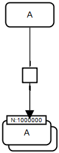

		</td>
		<td style="width:300px; text-align:center;">
			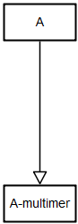
		</td>
	</tr>
	<tr style="font-size:90%">
		<td style="width:400px; text-align:center;">
			<a href="../images/specification/multimerization_2/pd.sbgn">SBGN-ML</a>&ensp;
			<a href="http://web.newteditor.org/?URL=https://www.pd2af.org/images/specification/multimerization_2/pd.sbgn" target="_blank">Newt</a>
		</td>
		<td style="width:300px; text-align:center;">
			<a href="../images/specification/multimerization_2/af.sbgn">SBGN-ML</a>&ensp;
			<a href="http://web.newteditor.org/?URL=https://www.pd2af.org/images/specification/multimerization_2/af.sbgn" target="_blank">Newt</a>
		</td>
	</tr>
</table> 
	

	

   <h4 style="color:black">3.12 Oligomerization x6 r</h4>

<table class="rules-table">
	<tr style="font-size:90%">
		<td style="width:400px; text-align:center;">
			
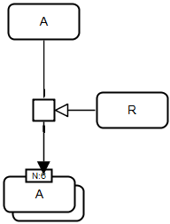

		</td>
		<td style="width:300px; text-align:center;">
			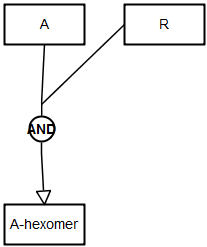
		</td>
	</tr>
	<tr style="font-size:90%">
		<td style="width:400px; text-align:center;">
			<a href="../images/specification/oligomerization_x6_r/pd.sbgn">SBGN-ML</a>&ensp;
			<a href="http://web.newteditor.org/?URL=https://www.pd2af.org/images/specification/oligomerization_x6_r/pd.sbgn" target="_blank">Newt</a>
		</td>
		<td style="width:300px; text-align:center;">
			<a href="../images/specification/oligomerization_x6_r/af.sbgn">SBGN-ML</a>&ensp;
			<a href="http://web.newteditor.org/?URL=https://www.pd2af.org/images/specification/oligomerization_x6_r/af.sbgn" target="_blank">Newt</a>
		</td>
	</tr>
</table>   

## Complexes
	

	

   <h4 style="color:black">5.1 Complex association with complex name</h4>

<table class="rules-table">
	<tr style="font-size:90%">
		<td style="width:400px; text-align:center;">
			
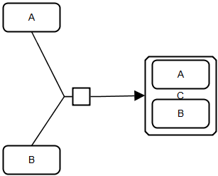

		</td>
		<td style="width:300px; text-align:center;">
			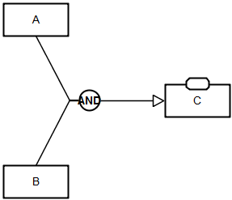
		</td>
	</tr>
	<tr style="font-size:90%">
		<td style="width:400px; text-align:center;">
			<a href="../images/specification/complex_association_with_complex_name/pd.sbgn">SBGN-ML</a>&ensp;
			<a href="http://web.newteditor.org/?URL=https://www.pd2af.org/images/specification/complex_association_with_complex_name/pd.sbgn" target="_blank">Newt</a>
		</td>
		<td style="width:300px; text-align:center;">
			<a href="../images/specification/complex_association_with_complex_name/af.sbgn">SBGN-ML</a>&ensp;
			<a href="http://web.newteditor.org/?URL=https://www.pd2af.org/images/specification/complex_association_with_complex_name/af.sbgn" target="_blank">Newt</a>
		</td>
	</tr>
</table> 
	

	

   <h4 style="color:black">5.2 Complex association</h4>

<table class="rules-table">
	<tr style="font-size:90%">
		<td style="width:400px; text-align:center;">
			
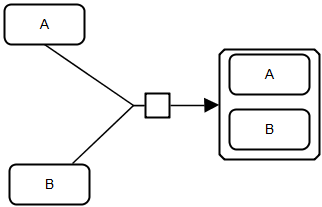

		</td>
		<td style="width:300px; text-align:center;">
			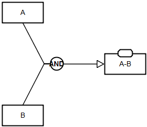
		</td>
	</tr>
	<tr style="font-size:90%">
		<td style="width:400px; text-align:center;">
			<a href="../images/specification/complex_association/pd.sbgn">SBGN-ML</a>&ensp;
			<a href="http://web.newteditor.org/?URL=https://www.pd2af.org/images/specification/complex_association/pd.sbgn" target="_blank">Newt</a>
		</td>
		<td style="width:300px; text-align:center;">
			<a href="../images/specification/complex_association/af.sbgn">SBGN-ML</a>&ensp;
			<a href="http://web.newteditor.org/?URL=https://www.pd2af.org/images/specification/complex_association/af.sbgn" target="_blank">Newt</a>
		</td>
	</tr>
</table> 
	

	

   <h4 style="color:black">5.3 Complex association regulated</h4>

<table class="rules-table">
	<tr style="font-size:90%">
		<td style="width:400px; text-align:center;">
			
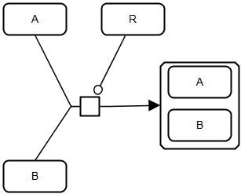

		</td>
		<td style="width:300px; text-align:center;">
			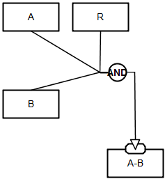
		</td>
	</tr>
	<tr style="font-size:90%">
		<td style="width:400px; text-align:center;">
			<a href="../images/specification/complex_association_regulated/pd.sbgn">SBGN-ML</a>&ensp;
			<a href="http://web.newteditor.org/?URL=https://www.pd2af.org/images/specification/complex_association_regulated/pd.sbgn" target="_blank">Newt</a>
		</td>
		<td style="width:300px; text-align:center;">
			<a href="../images/specification/complex_association_regulated/af.sbgn">SBGN-ML</a>&ensp;
			<a href="http://web.newteditor.org/?URL=https://www.pd2af.org/images/specification/complex_association_regulated/af.sbgn" target="_blank">Newt</a>
		</td>
	</tr>
</table> 
	

	

   <h4 style="color:black">5.4 Complex dissociation</h4>

<table class="rules-table">
	<tr style="font-size:90%">
		<td style="width:400px; text-align:center;">
			
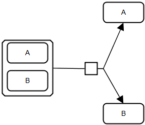

		</td>
		<td style="width:300px; text-align:center;">
			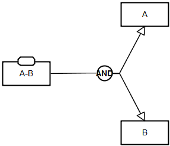
		</td>
	</tr>
	<tr style="font-size:90%">
		<td style="width:400px; text-align:center;">
			<a href="../images/specification/complex_dissociation/pd.sbgn">SBGN-ML</a>&ensp;
			<a href="http://web.newteditor.org/?URL=https://www.pd2af.org/images/specification/complex_dissociation/pd.sbgn" target="_blank">Newt</a>
		</td>
		<td style="width:300px; text-align:center;">
			<a href="../images/specification/complex_dissociation/af.sbgn">SBGN-ML</a>&ensp;
			<a href="http://web.newteditor.org/?URL=https://www.pd2af.org/images/specification/complex_dissociation/af.sbgn" target="_blank">Newt</a>
		</td>
	</tr>
</table>   

## Translocation
	

	

   <h4 style="color:black">4.1 Translocation 1</h4>

<table class="rules-table">
	<tr style="font-size:90%">
		<td style="width:400px; text-align:center;">
			

		</td>
		<td style="width:300px; text-align:center;">
			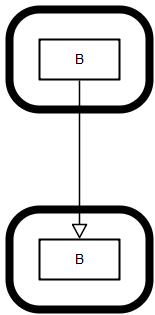
		</td>
	</tr>
	<tr style="font-size:90%">
		<td style="width:400px; text-align:center;">
			<a href="../images/specification/translocation_1/pd.sbgn">SBGN-ML</a>&ensp;
			<a href="http://web.newteditor.org/?URL=https://www.pd2af.org/images/specification/translocation_1/pd.sbgn" target="_blank">Newt</a>
		</td>
		<td style="width:300px; text-align:center;">
			<a href="../images/specification/translocation_1/af.sbgn">SBGN-ML</a>&ensp;
			<a href="http://web.newteditor.org/?URL=https://www.pd2af.org/images/specification/translocation_1/af.sbgn" target="_blank">Newt</a>
		</td>
	</tr>
</table> 
	

	

   <h4 style="color:black">4.2 Translocation 2</h4>

<table class="rules-table">
	<tr style="font-size:90%">
		<td style="width:400px; text-align:center;">
			
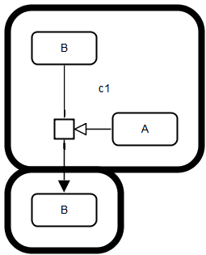

		</td>
		<td style="width:300px; text-align:center;">
			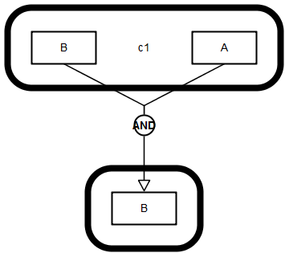
		</td>
	</tr>
	<tr style="font-size:90%">
		<td style="width:400px; text-align:center;">
			<a href="../images/specification/translocation_2/pd.sbgn">SBGN-ML</a>&ensp;
			<a href="http://web.newteditor.org/?URL=https://www.pd2af.org/images/specification/translocation_2/pd.sbgn" target="_blank">Newt</a>
		</td>
		<td style="width:300px; text-align:center;">
			<a href="../images/specification/translocation_2/af.sbgn">SBGN-ML</a>&ensp;
			<a href="http://web.newteditor.org/?URL=https://www.pd2af.org/images/specification/translocation_2/af.sbgn" target="_blank">Newt</a>
		</td>
	</tr>
</table>   

## Hidden inhibition
	

	

   <h4 style="color:black">6.1 Hidden inhibition 1</h4>

<table class="rules-table">
	<tr style="font-size:90%">
		<td style="width:400px; text-align:center;">
			
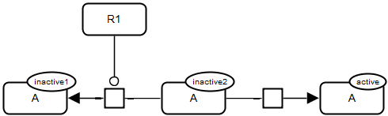

		</td>
		<td style="width:300px; text-align:center;">
			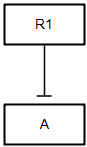
		</td>
	</tr>
	<tr style="font-size:90%">
		<td style="width:400px; text-align:center;">
			<a href="../images/specification/hidden_inhibition_1/pd.sbgn">SBGN-ML</a>&ensp;
			<a href="http://web.newteditor.org/?URL=https://www.pd2af.org/images/specification/hidden_inhibition_1/pd.sbgn" target="_blank">Newt</a>
		</td>
		<td style="width:300px; text-align:center;">
			<a href="../images/specification/hidden_inhibition_1/af.sbgn">SBGN-ML</a>&ensp;
			<a href="http://web.newteditor.org/?URL=https://www.pd2af.org/images/specification/hidden_inhibition_1/af.sbgn" target="_blank">Newt</a>
		</td>
	</tr>
</table> 
   

	
   <h4 style="color:black">6.2 Hidden inhibition 2</h4>

<table class="rules-table">
	<tr style="font-size:90%">
		<td style="width:400px; text-align:center;">
			
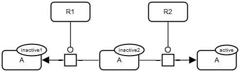

		</td>
		<td style="width:300px; text-align:center;">
			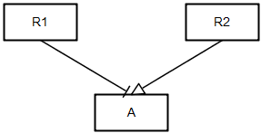
		</td>
	</tr>
	<tr style="font-size:90%">
		<td style="width:400px; text-align:center;">
			<a href="../images/specification/hidden_inhibition_2/pd.sbgn">SBGN-ML</a>&ensp;
			<a href="http://web.newteditor.org/?URL=https://www.pd2af.org/images/specification/hidden_inhibition_2/pd.sbgn" target="_blank">Newt</a>
		</td>
		<td style="width:300px; text-align:center;">
			<a href="../images/specification/hidden_inhibition_2/af.sbgn">SBGN-ML</a>&ensp;
			<a href="http://web.newteditor.org/?URL=https://www.pd2af.org/images/specification/hidden_inhibition_2/af.sbgn" target="_blank">Newt</a>
		</td>
	</tr>
</table>   
   

## Simple schemes
	

	

   <h4 style="color:black">8.1 raf-mek-erk</h4>

<table class="rules-table">
	<tr style="font-size:90%">
		<td style="width:400px; text-align:center;">
			
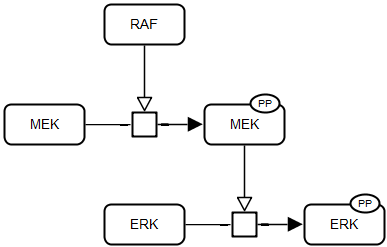

		</td>
		<td style="width:300px; text-align:center;">
			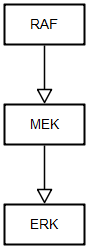
		</td>
	</tr>
	<tr style="font-size:90%">
		<td style="width:400px; text-align:center;">
			<a href="../images/specification/raf-mek-erk/pd.sbgn">SBGN-ML</a>&ensp;
			<a href="http://web.newteditor.org/?URL=https://www.pd2af.org/images/specification/raf-mek-erk/pd.sbgn" target="_blank">Newt</a>
		</td>
		<td style="width:300px; text-align:center;">
			<a href="../images/specification/raf-mek-erk/af.sbgn">SBGN-ML</a>&ensp;
			<a href="http://web.newteditor.org/?URL=https://www.pd2af.org/images/specification/raf-mek-erk/af.sbgn" target="_blank">Newt</a>
		</td>
	</tr>
</table> 
      

## New schemes
	

	

   <h4 style="color:black">9.1 Currency metabolites 1</h4>

<table class="rules-table">
	<tr style="font-size:90%">
		<td style="width:400px; text-align:center;">
			
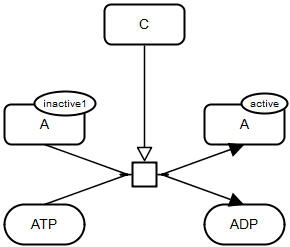

		</td>
		<td style="width:300px; text-align:center;">
			
		</td>
	</tr>
	<tr style="font-size:90%">
		<td style="width:400px; text-align:center;">
			<a href="../images/specification/currency_metabolites_1/pd.sbgn">SBGN-ML</a>&ensp;
			<a href="http://web.newteditor.org/?URL=https://www.pd2af.org/images/specification/currency_metabolites_1/pd.sbgn" target="_blank">Newt</a>
		</td>
		<td style="width:300px; text-align:center;">
			<a href="../images/specification/currency_metabolites_1/af.sbgn">SBGN-ML</a>&ensp;
			<a href="http://web.newteditor.org/?URL=https://www.pd2af.org/images/specification/currency_metabolites_1/af.sbgn" target="_blank">Newt</a>
		</td>
	</tr>
</table> 
	

	

   <h4 style="color:black">9.2 Noncurrency metabolites 1</h4>

<table class="rules-table">
	<tr style="font-size:90%">
		<td style="width:400px; text-align:center;">
			
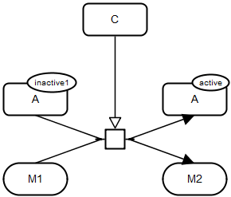

		</td>
		<td style="width:300px; text-align:center;">
			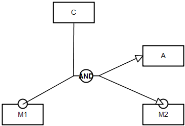
		</td>
	</tr>
	<tr style="font-size:90%">
		<td style="width:400px; text-align:center;">
			<a href="../images/specification/noncurrency_metabolites_1/pd.sbgn">SBGN-ML</a>&ensp;
			<a href="http://web.newteditor.org/?URL=https://www.pd2af.org/images/specification/noncurrency_metabolites_1/pd.sbgn" target="_blank">Newt</a>
		</td>
		<td style="width:300px; text-align:center;">
			<a href="../images/specification/noncurrency_metabolites_1/af.sbgn">SBGN-ML</a>&ensp;
			<a href="http://web.newteditor.org/?URL=https://www.pd2af.org/images/specification/noncurrency_metabolites_1/af.sbgn" target="_blank">Newt</a>
		</td>
	</tr>
</table> 
	

	

   <h4 style="color:black">9.3 Regulation combining 1</h4>

<table class="rules-table">
	<tr style="font-size:90%">
		<td style="width:400px; text-align:center;">
			
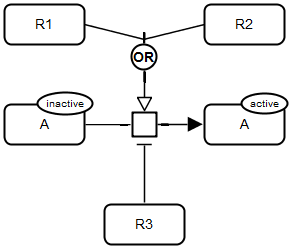

		</td>
		<td style="width:300px; text-align:center;">
			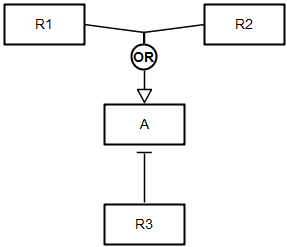
		</td>
	</tr>
	<tr style="font-size:90%">
		<td style="width:400px; text-align:center;">
			<a href="../images/specification/regulation_combining_1/pd.sbgn">SBGN-ML</a>&ensp;
			<a href="http://web.newteditor.org/?URL=https://www.pd2af.org/images/specification/regulation_combining_1/pd.sbgn" target="_blank">Newt</a>
		</td>
		<td style="width:300px; text-align:center;">
			<a href="../images/specification/regulation_combining_1/af.sbgn">SBGN-ML</a>&ensp;
			<a href="http://web.newteditor.org/?URL=https://www.pd2af.org/images/specification/regulation_combining_1/af.sbgn" target="_blank">Newt</a>
		</td>
	</tr>
</table>

   

  </body>
